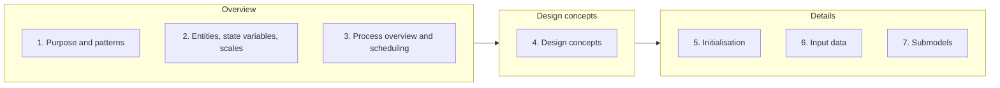

# Grimm et al. (2020) — The ODD Protocol: A Second Update

> [!abstract] Orientation — read this first (~1 min)
> **The problem this paper solves.** ODD spread far beyond the ecology community that
> invented it, and the authors went and read the results. Many published ODDs are incomplete,
> too long to be read, unusable for re-implementation, and disconnected from the model's code.
> This paper diagnoses why and supplies the guidance that was missing.
>
> **Core claims**
> 1. The seven ODD elements are unchanged. Everything in this update is guidance, formats, and
>    one renamed element.
> 2. Element 1 becomes "Purpose and patterns", so the patterns used to evaluate the model are
>    stated before the model structure that was chosen on their basis.
> 3. Every element gains an optional "Rationale" subsection — why the design decision was
>    made, not only what it was.
> 4. The commonest defect is describing the modeller's mental model rather than what the
>    program does; the resulting ODD cannot be re-implemented.
> 5. ODDs run 5–10 pages, or 30–40 for complex models, so the paper supplies a summary-ODD
>    format for the article body with the full ODD in a supplement.
> 6. Two further formats handle re-use: nested ODDs for large submodels, delta-ODDs for
>    modified models.
> 7. ODD should link explicitly to model code, because the code is the most authoritative
>    description a model has.
> 8. Only the design concepts are ABM-specific, so ODD could describe any simulation model —
>    the "lingua franca" claim.
>
> **Prerequisites.** [[odd-protocol]], [[agent-based-model]], [[model-structure]],
> [[pattern-oriented-modelling]].
> **Where it sits.** Supersedes [[grimm-odd-2010]], the version taught in
> [[w02a-describing-models]] and assumed by [[a1-project-specification]]. Read for the
> summary-ODD guidance and the rationale subsections, both of which apply directly to the
> assignment report.
> **Source.** JASSS 23(2) 7, doi 10.18564/jasss.4259 · 16 pages, sections 1–6 plus seven
> supplements · **digest read time ~11 min**

---

## The Spine

Anchors are JASSS paragraph numbers. Section titles are the paper's own.

### Introduction: what ODD is and why it exists
`¶1.1–1.6`

ABMs became widely applied in ecology in the 1990s and in the social sciences around 2000.
Mathematics, the universal language for describing models completely and concisely, is
neither complete nor convenient for simulation models — so early ABM descriptions were hard
to write and hard to read, because nobody knew where to put which kind of information, or in
what detail. Descriptions were often incomplete enough that re-implementation was impossible,
which violates the central requirement of science that materials and methods be specified in
enough detail to allow replication ([[reproducibility]]). ODD was proposed to exploit the
fact that ABMs share common characteristics, so a common language for them is both feasible
and useful. The paper positions ODD alongside other responses to the replication crisis.

ODD descriptions are written text intended to be read by humans, and are independent of the
hardware and software used to implement the model. Equations and short algorithms are
allowed. The protocol consists of seven elements, grouped into three categories, and it is
the seven elements — not the three categories — that define it:

The eleven design concepts hanging off element 4, exactly as the paper's Figure 1 lists them:

| | | |
|---|---|---|
| Basic principles | Emergence | Adaptation |
| Objectives | Learning | Prediction |
| Sensing | Interaction | Stochasticity |
| Collectives | Observation | |

> [!warning] Ten or eleven?
> [[w02a-describing-models]] teaches ten design concepts, merging learning and prediction.
> The protocol lists eleven with those two separate. Concepts that do not apply may be left
> out; a concept of general interest that ODD lacks may be added at the end of the element.
> Use whichever count the assignment template uses, but know the protocol's own number.

What each element carries, per `¶1.4`: element 2 lists entity types (spatial units, agents,
the environment), the state variables characterising each type — variables that may vary
among entities of the same type or vary over time — and the temporal and spatial resolution
and extent. Element 3 gives an overview only: which entities do what, at what time, in what
order, and when state variables are updated. The processes themselves are described in
element 7, not here. Elements 5, 6 and 7 provide the detail needed to fully understand the
model and, in principle, completely re-implement it.

Two developments since 2006 shaped this update. ODD spread well beyond ecology. And its
purpose broadened from describing models to improving model design — by requiring modellers
to describe every part of a model, especially the design concepts unique to ABMs, ODD
encourages them to think about, research, and justify each design decision.

### ODD's benefits and current use
`¶2.1–2.7`

Because ODD is used by domain experts across many fields, it is deliberately less technical
than the alternatives and focused on communication within and across disciplines
([[model-communication]]). Other standards exist for reporting simulation models,
particularly in discrete event simulation, but they are checklist-oriented and have not been
adopted for ABMs.

The hierarchical structure — overview first, details later — is the design feature that makes
ODDs efficient to read: readers decide how far down to go. It implies some redundancy, which
the paper accepts as a cost.

The design concepts element does double duty. It explains *why* the model was designed as it
was, and serves as a checklist for authors and readers alike, because each of the eleven
affects the scope and utility of the model. The paper singles out one design decision as
critical: which processes are imposed via empirical parameters and rules, and which arise
from adaptive decision-making by the agents. Representing dynamics as adaptive makes ABMs
more flexible and more predictive, but usually only a few processes can be modelled this way,
so selecting them must be done carefully and justified clearly.

On uptake: ODD was quickly adopted by ecological modellers, prompting the 2010 first update
based on use in more than 50 publications ([[grimm-odd-2010]]). A bibliometric analysis
(Vincenot 2018) shows ODD contributed to integrating agent-based modelling across
disciplines by linking the historically separate "individual-based" and "agent-based"
literatures. Figure 2 tracks the annual share of ODD-reliant papers in four fields: growth is
significant only in the life sciences, and overall the share has changed slightly since 2011.
Citation counts as of November 2019: 2,258 for the 2006 paper, 1,783 for the 2010 one.

The authors do not expect universal adoption, and concede ODD has limits for some model
kinds, discrete-event simulations among them.

### Issues and challenges
`¶3.1–3.19`

The diagnostic core of the paper. Six problems, each with a lesson attached.

**Guidance materials are few and not often used** (`¶3.2–3.5`). The only ODD guidance was a
template in the supplement of the 2010 paper — not open access, rarely used, brief, and now
outdated. Most users report initial difficulty understanding key elements, especially state
variables and some design concepts, so many early ODDs never used the protocol as intended.

The deeper reason for incompleteness is more interesting than missing documentation.
Modellers tend to describe the mental representation of the model, or the narrative of the
model, rather than the structure and processes of the program that implements it. These
meta-descriptions of mental models are inevitably incomplete, because it is not possible to
mentally represent an entire program.

> [!tip] The motto for this failure mode
> *Describe what the program does, not what you think the model does.*
> This is the single most transferable line in the paper, and it applies to writing up any
> model you have implemented, assignment reports included.

**It is unclear whether design rationale belongs in an ODD** (`¶3.6–3.8`). The original
authors were concerned strictly with describing models accurately, and never settled whether
an ODD should say *why* each element was designed as it was. Some ODDs are purely
descriptive, others explanatory. As ODD developed into a design tool, rationale became more
obviously valuable, for two reasons: it increases model credibility by pushing developers to
think through and test each decision and by showing readers that evidence, and it increases
re-use of techniques and theory across a discipline — developers look for existing techniques,
and later modellers can tell which parts of a model are suitable for re-use.

Three productive ways to include rationale: state the basis for all parameter values (which
literature, which data, estimated by calibration and how); implement and analyse each major
submodel separately to show it behaves reasonably under all conditions occurring in the full
ABM; and use [[pattern-oriented-modelling]] to justify critical design decisions about
variables, scales, and agent behaviour representation.

**ODDs are often long and must be summarised** (`¶3.9–3.10`). Typical ODDs run 5–10 pages.
The length is only partly due to hierarchical redundancy and the design-concepts discussion;
mostly it is that ABMs are more complex than typical mathematical models, and algorithms take
more space to describe than equations. ODDs are less succinct than specification languages
like Z-notation precisely because they aim to be understandable by everybody, so they are
written in plain English.

The consequence is the real problem: complete ODDs end up as supplements, which are not
necessarily reviewed or read as carefully. Authors respond by providing only a summary and
offering code on request — which the authors reject, since a full model description is a
*conditio sine qua non* for ODD as a scientific tool. What was missing was guidance for
producing a summary ODD both concise and precise enough for a main text.

**ODD lacks a hierarchical approach for highly complex ABMs** (`¶3.11`). Most ABMs are of
intermediate complexity, giving 5–10 page ODDs. Complex ones — power markets, honeybee
colonies, stream fish, harbour porpoises — exceed 30–40 pages and often contain submodels
that each need 10 or more pages. ODD does not encourage describing such a submodel in a
format resembling an entire ODD.

**Creating a new ODD when re-using parts of a model is inefficient** (`¶3.12–3.13`).
Facilitating re-use is a primary motivation for ODD, yet the protocol says nothing about how
to document a new version of an existing model. Must you produce a completely new ODD? Can
you cite the old one, copy the relevant parts, or write a "delta-ODD" describing only the
changes? Re-creating an existing ODD is inefficient and risks introducing errors — though it
also identifies and corrects some.

**ODD still seems ambiguous** (`¶3.14–3.16`). Some modellers perceive ODD as too narrative to
make models reproducible, a perception traceable to its characterisation as a "written"
format, which is misread as "purely verbal". Even written descriptions with equations and
pseudo-code may not contain everything needed for unambiguous replication. Many modellers
believe, with good reason, that reading the code is the only completely reliable way to
understand what a model does — and until now ODD has not facilitated using the code as part
of the description. The focus on describing models so completely that reading code is
unnecessary was intentional, since computer code can be as hard to understand as a written
description, but links between the two would help readers who need to know exactly how a
model works.

There is a contrary view worth holding onto. In the social sciences, ODD can be seen as not
narrative *enough*: social science modelling typically runs a narrative through every model
element, and ODD's separate sections can make the connecting thread hard to see. The paper
attributes this to a genuine disciplinary difference — natural sciences built on entities and
variables, sociology on discourse and communication.

**ODD is not clearly linked to pattern-oriented modelling** (`¶3.17–3.19`). POM is a strategy
for basing the design, evaluation and parameterisation of ABMs on patterns observed in the
real system. Its three parts: (a) selecting model entities, state variables and scales so the
observed patterns can be reproduced; (b) testing theory for agent behaviours by checking
whether alternative behavioural submodels cause the patterns to emerge; and (c) using
quantitative patterns to identify useful parameter values. POM addresses three of the biggest
problems in agent-based modelling — the right level of detail, how to model agent behaviour,
how to estimate parameter values — and, alongside ODD, was among the six "fusion papers" that
contributed most to unifying ABM across disciplines.

Even when POM is not used explicitly, observed patterns are almost always important in model
design: very often the purpose of an ABM is to explain patterns observed in reality, so those
patterns are the criteria for whether the model is useful. Even toy models rest on general
patterns — equilibrium population dynamics, segregation in cities, flocking in birds
([[schelling-segregation-model]], [[boids]]). The frustration was that ODD had no specific
place for patterns and it was not obvious where they should go. The lesson: ODD needs a place
for the patterns used to design and evaluate a model, and that place must come *before* the
entities and state variables that are chosen on the basis of those patterns.

### The solutions
`¶4.1–4.24`

Most fixes ship as supplements rather than changes to the protocol.

| Supplement | Contents |
|---|---|
| S1 | Full ODD guidance and checklists — rationale, specific guidance, checklist and examples for each of the seven elements and each of the eleven design concepts |
| S2 | Template and examples for writing summary ODDs |
| S3 | Guidance and examples for nested ODDs |
| S4 | Guidance for ODDs of modified models |
| S5 | Licence agreement template, so ODD text can be legally re-used |
| S6 | Example TRACE documents ([[trace-documentation]]) |
| S7 | Template for describing simulation experiments |

**Inclusion of rationale** (`¶4.3–4.4`). Each ODD element now includes an optional
"Rationale" subsection. Users may still restrict an ODD to description — the paper's example
is user documentation for a widely used model, or documenting somebody else's model. Because
rationale can add many pages (literature review, data analysis, alternatives considered), the
alternative home for it is a TRACE document, which justifies all major design elements.

**Summarising ODDs** (`¶4.5–4.9`). Always write the full ODD first, whether or not it goes in
the main text. The summary's purpose is a narrative description of the entire model that is
still specific enough for the main results to be understood without resorting to the full
description. Concrete recipe:

- Start with the three overview elements, brought into a narrative, story-like form.
- Omit section titles; move long lists of state variables to tables.
- Describe entities together with the processes they execute, if that improves the narrative.
- Italicise ODD keywords — *purpose*, *entities*, *state variables*, *scales*, *processes*,
  *schedule*, *design concept*, *initialization*, *submodel* — so readers can find the
  corresponding detail in the full ODD.
- Present in detail only the design concepts and submodels essential to understanding the
  main idea and the application at hand.
- Describe initialisation and input data only if essential — scenarios with different initial
  conditions, or input data that drives the dynamics. If external drivers are key to the
  question, say where in the model they enter and how their effects are represented.
- If the narrative still doesn't come through, present the overall narrative first without
  ODD terminology, then the summary ODD and a link to the full one.
- Consider a graphical "visual ODD" (the paper's Figure 3 shows one, split into
  initialisation, submodels, and analyses).

**Hierarchical ODDs** (`¶4.10–4.11`). If a submodel needs 10 or more pages, write a nested
ODD: describe the submodel largely as a full ABM is described, using a reduced protocol of
element 1 (Purpose and patterns), element 3 (Process overview and scheduling) and element 7
(Submodels). The other elements — entities and state variables, design concepts,
initialisation, input data — still refer to the entire model, not the submodel. Two further
readability measures: group parameters by the submodel that uses them rather than one large
table, and where many equations are used, summarise them in tables and explain the rationale
of each in the text.

**Re-using parts of existing models** (`¶4.12–4.18`). The delta-ODD identifies which ODD
elements changed and provides new descriptions for those. It is appropriate *only* when the
original ODD is readily available to anyone attempting to use it — re-published as a
supplement, or freely available online with a link in the delta-ODD. In the authors'
experience that often fails: the original ODD isn't freely available, or a journal requires
self-contained descriptions, or the new model re-uses only part of the old one. The efficient
route is then to copy the relevant parts of the previous ODD into the new one, crediting the
original authors and making clear which work is theirs — the paper recommends distinguishing
re-used from original text by font or colour, and publishing under terms that don't violate
the original licence.

This raises copyright, which is why S5 exists. For most journals, supplements are not subject
to journal copyright as long as the journal has not invested in their layout, so copyright
remains with the author — though authors should check the Copyright Transfer Agreement. The
recommendation is to attach a licence to the ODD, with a copyleft clause and a no-warranty
disclaimer.

**Linking ODD to code** (`¶4.19–4.22`). To many simulation scientists a model's code is its
most authoritative and unambiguous description, so clear links between ODD and code make a
model more transparent and its description less ambiguous. Most programming languages are
similar enough that a reader unfamiliar with the language can still check an algorithm against
the ODD narrative. This requires the code to be licensed and available with the ODD.

The paper is candid about limits: teams that spent years building a model want to benefit
from it first, and may release key algorithms rather than the full program. Code alone is also
insufficient — compiler or interpreter, libraries, numerical methods, and even hardware and
OS matter, so at minimum revision numbers of external software, library, architecture (x86,
32/64 bit) and OS version should be given. [[netlogo]] gets a specific mention: it provides
many powerful primitives that must be fully understood to understand a model's code, which is
almost always possible from its documentation.

Three mechanisms for the links, cheapest first: consistent naming of variables, parameters and
submodels across ODD and code, plus code comments identifying ODD elements or numbered
equations; a single document with hyperlinks from ODD to the corresponding code (the BEEHAVE
honeybee model did this); or a table mapping each ODD element, submodel or algorithm to its
file, procedure, or line number.

**Linking ODD to POM** (`¶4.23–4.24`). Element 1 is supplemented to explicitly include the
patterns used in POM to design and evaluate the model, or otherwise serving as criteria for
whether the model is realistic enough for its purpose. Two reasons for putting them in element
1 specifically: patterns are used to select entities, state variables and scales, so they must
be identified before those components are described in element 2; and purpose and patterns are
tightly linked, since explaining the patterns is often part of the purpose and the patterns
determine whether the model suits its purpose.

The guidance also asks for the model's overall purpose in more detail, since different
purposes imply different design and evaluation criteria — broad categories being
understanding/explanation, prediction, and demonstration of ideas
([[explanation-vs-prediction]]).

> [!warning] The HARKing caveat
> Reporting in element 1 only the patterns the model *could* capture, while omitting patterns
> observed in reality that were considered essential before development and that the model
> consistently failed to reproduce, resembles HARKing — Hypothesizing After Results are Known.
> Better practice is to report the missing patterns, which indicates that important processes
> were not yet identified or understood, and primes the reader for the discussion.

### Outlook
`¶5.1–5.15`

Four directions, all flagged as requiring consideration and testing by the community rather
than as settled.

**ODD for non-agent-based simulation models** (`¶5.2–5.5`). Only parts of the design concepts
element are ABM-specific — emergence of behaviour, adaptation, objectives, learning,
prediction, sensing, collectives. Every other element applies to any simulation model. ODD has
already been used for matrix models, an integral projection model, a difference-equation model
of pastoral-nomadic range management, and hybrid models that couple ABMs with other approaches
(dynamic energy budget theory formulated as ODEs, system-dynamics stock-and-flow submodels).
The suggested addition for hybrid models is a subsection in "Submodels" describing under which
framework submodels were coupled, when they interact, and which variables and processes carry
data exchange and synchronisation — the "hooks" between them.

**ODD and simulation experiments** (`¶5.6–5.8`). An ODD corresponds to the *Materials* part of
a Materials and Methods section: it describes the virtual laboratory. The *Methods* equivalent
must describe how the model was used in simulation experiments. Earlier ODD publications
recommended following an ODD with a "Simulation Experiments" section but gave no guidance. The
authors debated extending ODD to cover this and **chose not to** — standardising experiment
description is as complex as ODD itself and deserves separate treatment, and designing
experiments is a separate task from designing a model, since the same model serves different
experiments and the same experiments can run on different models. S7 offers a possible
template with elements adopted from TRACE.

**Automated links between ODD and code** (`¶5.9–5.12`). Technically plausible: ABM is a direct
form of object-oriented formalisation, so ODD's entities, state variables and processes map
onto OOP classes, attributes and methods, and an ODD could in principle generate code
skeletons the way UML-to-code conversion does. Four cautions against it. ODD is written for
people, not computers, and only verbal non-technical description forces you to understand what
a model is, how it works, and why it was designed that way — markup languages read well by
computers do not force that. Platforms that partially automated development helped mainly with
the easy parts. The semantic links between OOP classes and everyday meanings are less
straightforward than they look to a naïve programmer. And locking design documentation before
implementation echoes the waterfall model, which suits small mono-disciplinary teams and fits
badly with the iterative and agile approaches now considered more effective for
transdisciplinary work. Literate programming is floated as an alternative worth considering.

**Organising ODD's maintenance** (`¶5.13–5.15`). ODD has been promoted by a small group of
experienced modellers; who maintains it long term is unresolved. Existing networks such as
CoMSES might be appropriate if they are not domain-specific. A second proposal: allow ODDs to
be reviewed and certified by users who have undergone training and produced high-quality ODDs
themselves — "official" certifiers qualified by attending courses, submitting their own ODDs,
and being examined by reviewing test ODDs, along the lines of CRAN's quality check.

### Discussion
`¶6.1–6.3`

ODD has been used far more widely than its developers anticipated, which indicates a standard
format for describing ABMs is needed and useful. The authors call it a positive-feedback
technology: the more it is used, the more valuable it becomes to its users and communities.
Benefits already realised include unifying agent-based science by connecting the "agent-based"
and "individual-based" literatures, facilitated comparison and review of models, and re-use of
validated submodels — "pattern-oriented theory development". The closing caution is about
timescale: the language of mathematics developed over hundreds of years, so a lingua franca
for ABMs cannot be expected within a few years.

---

## Recall Layer

> [!question]- Did this update change the seven ODD elements?
> No. The seven elements and their numbering are unchanged and are to be used as given. What
> changed: element 1 is renamed "Purpose and patterns", each element gains an optional
> "Rationale" subsection, and seven supplements add guidance and new formats. `¶1.3`, `¶4.1`

> [!question]- Why were patterns placed in element 1 rather than somewhere later?
> Two reasons. Patterns are used to select the entities, state variables and scales, so they
> must be identified before those are described in element 2. And purpose and patterns are
> tightly linked — explaining the patterns is often part of the purpose, and the patterns
> determine whether the model is suitable for that purpose. `¶4.23`

> [!question]- What is the deeper reason ODDs come out incomplete, beyond weak guidance?
> Modellers describe the mental representation or narrative of the model rather than the
> structure and processes of the program implementing it. Such meta-descriptions are
> inevitably incomplete, because a whole program cannot be mentally represented. Motto:
> describe what the program does, not what you think the model does. `¶3.4–3.5`

> [!question]- Why is ODD length a scientific problem and not just an inconvenience?
> Long ODDs get relegated to supplements, which are not necessarily reviewed or read
> carefully. Authors respond by publishing only a summary and offering code on request, which
> the authors reject — a complete model description is a *conditio sine qua non* for ODD as a
> scientific tool. `¶3.10`

> [!question]- Give the recipe for a summary ODD in four points.
> Write the full ODD first, always. Start from the three overview elements in narrative form.
> Drop section titles, move long state-variable lists to tables, and describe entities together
> with their processes where that helps the story. Italicise ODD keywords so readers can find
> the corresponding detail in the full ODD, and present in detail only the design concepts and
> submodels essential to the main idea. `¶4.6–4.7`

> [!question]- What is a nested ODD, and which elements does it contain?
> A submodel needing 10 or more pages described largely as a full ABM would be, using a reduced
> protocol: element 1 (Purpose and patterns), element 3 (Process overview and scheduling), and
> element 7 (Submodels). Entities and state variables, design concepts, initialisation and
> input data still refer to the entire model. `¶4.10`

> [!question]- When is a delta-ODD appropriate, and when is it not?
> Appropriate when the original model's ODD is readily available to anyone — re-published as a
> supplement or freely online with a link in the delta-ODD. Not appropriate when the original
> ODD isn't freely available, when a journal requires self-contained model descriptions, or
> when the new model includes only part of the previous one plus many new parts. Then copy the
> relevant parts with full credit. `¶4.13–4.15`

> [!question]- Why does the paper want ODD linked to code, given ODD was designed to make
> reading code unnecessary?
> Because to many simulation scientists the code is the model's most authoritative and
> unambiguous description, and readers who need to know exactly how a model works are otherwise
> stuck when the narrative is ambiguous. The original focus was intentional — code can be as
> hard to understand as prose — but links are a lifeline, not a replacement. `¶3.14`, `¶4.19`

> [!question]- Name the three mechanisms for linking an ODD to its code.
> Consistent naming of variables, parameters and submodels across both, plus code comments
> identifying ODD elements or numbered equations; a single document with hyperlinks from ODD to
> code, as done for the BEEHAVE honeybee model; or a table mapping each element, submodel or
> algorithm to file, procedure, or line number. `¶4.21–4.22`

> [!question]- What is the argument that ODD could describe any simulation model?
> Only parts of the design concepts element are ABM-specific — emergence of behaviour,
> adaptation, objectives, learning, prediction, sensing, collectives. Every other element is
> relevant to any simulation model, and ODD has already been used for matrix models, integral
> projection models, difference-equation models and hybrids. `¶5.2–5.4`

> [!question]- The authors considered extending ODD to cover simulation experiments. Why did
> they decline?
> Standardising experiment description would be as complex as ODD itself and deserves separate,
> in-depth treatment. Designing and describing experiments is also a separate task from
> designing a model: the same model is used for different experiments, and the same experiments
> are sometimes run on different models. `¶5.7`

> [!question]- Give two of the four cautions against automatically generating code from an ODD.
> Any two of: ODD is written for people, and only verbal non-technical description forces you
> to understand what the model is, how it works and why it was designed that way; partial
> automation on existing platforms helped only with the parts that were easy anyway; the
> semantic links between OOP classes and everyday meanings are less straightforward than they
> appear; and locking design documentation before implementation echoes the waterfall model,
> which fits badly with iterative and agile transdisciplinary work. `¶5.10–5.11`

> [!question]- What is the HARKing risk in the new element 1?
> Reporting only the patterns the model turned out to capture, while omitting patterns
> considered essential before development that the model consistently failed to reproduce.
> Missing patterns should be reported — they indicate processes not yet identified or
> understood. `¶4.24`

> [!question]- Which design decision does the paper single out as critical and requiring
> explicit justification?
> Which processes are imposed via empirical parameters and rules, versus which arise from
> adaptive decision-making by agents. Adaptive representation makes ABMs more flexible and
> predictive, but usually only a few processes can be modelled that way. `¶2.3`

> [!failure] Common failure modes
> - **Thinking the protocol changed.** The seven elements are identical to 2010. Someone who
>   learned ODD from [[grimm-odd-2010]] has not learned a superseded structure.
> - **Ten design concepts vs eleven.** Learning and prediction are separate in the protocol and
>   merged in the lecture. Both counts appear in circulation; know which document you are
>   answering to.
> - **Writing a summary ODD instead of a full one.** The instruction is to write the full ODD
>   first and summarise from it. Writing only the summary is the practice the paper explicitly
>   rejects.
> - **Putting processes in element 3.** Element 3 is an overview — who does what, when, in what
>   order, and when state variables are updated. The processes themselves belong in element 7.
> - **Assuming supplements are copyright-free.** Usually copyright stays with the author because
>   the journal hasn't invested in the supplement's layout — but the Copyright Transfer
>   Agreement decides, and it must be checked.
> - **Treating "ODD is narrative" as a criticism with one direction.** Natural scientists find
>   ODD too narrative to be reproducible; social scientists find it not narrative enough to
>   carry the model's story. Both complaints are in the paper.

> [!exam] Exam surface
> The examinable core is the seven elements and what belongs in each — particularly the
> overview/detail split between elements 3 and 7 — plus the eleven design concepts. Beyond
> recall: why patterns moved into element 1, the mental-model failure mode and its motto, the
> summary/nested/delta-ODD trio and when each applies, and the argument that ODD generalises
> beyond ABMs because only the design concepts are ABM-specific. A likely applied prompt is to
> justify a design decision in ODD terms, or to say where a given piece of information belongs.

> [!todo] Open threads
> - Who maintains ODD long-term is unresolved; CoMSES is floated, certification of ODD
>   reviewers is a proposal only.
> - No template for describing simulation experiments is settled — S7 is offered as "a possible
>   template", adopted from TRACE.
> - Whether ODD can become a lingua franca for simulation modelling generally is asserted as
>   plausible and untested. The authors themselves say a few years is not enough time.
> - The paper doesn't resolve how narrative an ODD should be; it says the right amount varies
>   by discipline and that ODD should ideally accommodate the variation.

---

## Topics covered

- [x] `¶1.1–1.2` — ABM history; incomplete descriptions; the replication crisis → [[#Introduction: what ODD is and why it exists]]
- [x] `¶1.3–1.4` — The seven elements, three categories, eleven design concepts, what each element holds → [[#Introduction: what ODD is and why it exists]]
- [x] `¶1.5–1.6` — Spread beyond ecology; ODD as a design tool; the paper's own roadmap → [[#Introduction: what ODD is and why it exists]]
- [x] `¶2.1–2.3` — Other standards; hierarchical structure; design concepts as checklist; adaptive vs imposed processes → [[#ODD's benefits and current use]]
- [x] `¶2.4–2.6` — Adoption history; Vincenot's bibliometrics; Figure 2; citation counts → [[#ODD's benefits and current use]]
- [x] `¶2.7` — Why ODD hasn't spread everywhere → [[#ODD's benefits and current use]]
- [x] `¶3.2–3.5` — Guidance scarcity; mental-model descriptions; the motto → [[#Issues and challenges]]
- [x] `¶3.6–3.8` — Whether rationale belongs in an ODD; three ways to include it → [[#Issues and challenges]]
- [x] `¶3.9–3.10` — Length; supplements; why summary-only is rejected → [[#Issues and challenges]]
- [x] `¶3.11` — Complex ABMs and the missing hierarchy → [[#Issues and challenges]]
- [x] `¶3.12–3.13` — Re-use and the delta-ODD question → [[#Issues and challenges]]
- [x] `¶3.14–3.16` — Ambiguity relative to code; the social-science counter-view → [[#Issues and challenges]]
- [x] `¶3.17–3.19` — POM's three parts; why patterns had no home in ODD → [[#Issues and challenges]]
- [x] `¶4.1–4.2` — Table 1, the seven supplements; updated learning materials → [[#The solutions]]
- [x] `¶4.3–4.4` — Rationale subsections; TRACE as the alternative home → [[#The solutions]]
- [x] `¶4.5–4.9` — Summary ODDs, the full recipe, visual ODDs (Figure 3) → [[#The solutions]]
- [x] `¶4.10–4.11` — Nested ODDs; parameter grouping; equation tables → [[#The solutions]]
- [x] `¶4.12–4.18` — Delta-ODDs; copying with credit; copyright and licensing → [[#The solutions]]
- [x] `¶4.19–4.22` — Linking ODD to code; software versioning; NetLogo primitives; BEEHAVE → [[#The solutions]]
- [x] `¶4.23–4.24` — POM folded into element 1; purpose categories; HARKing caveat → [[#The solutions]]
- [x] `¶5.2–5.5` — ODD for non-ABM and hybrid models; submodel "hooks" → [[#Outlook]]
- [x] `¶5.6–5.8` — Simulation experiments; Materials vs Methods; why they declined → [[#Outlook]]
- [x] `¶5.9–5.12` — Automated ODD-to-code links and the four cautions; literate programming → [[#Outlook]]
- [x] `¶5.13–5.15` — Maintenance; CoMSES; certified ODD reviewers → [[#Outlook]]
- [x] `¶6.1–6.3` — Positive-feedback technology; benefits realised; the timescale caution → [[#Discussion]]

Table 2 reproduces the S1 guidance for element 1 as a worked example; its substance —
specific purpose, testable patterns, don't describe the model yet, make the purpose statement
independent of the article — is folded into the spine rather than reproduced as a block.

## Connections

`See also:` [[sources/grimm-2020-odd-second-update]] · [[odd-protocol]] ·
[[pattern-oriented-modelling]] · [[trace-documentation]] · [[grimm-odd-2010]] ·
[[volker-grimm]] · [[model-communication]] · [[reproducibility]] · [[model-structure]] ·
[[epstein-why-model-digest]] · [[a1-project-specification]]
