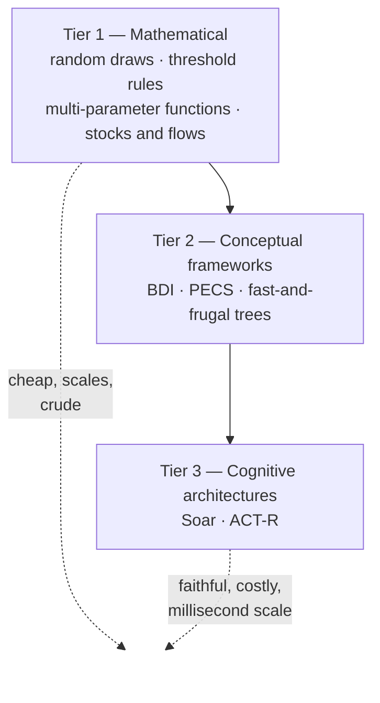

# Kennedy (2012) — Modelling Human Behaviour in Agent-Based Models

> [!abstract] Orientation — read this first (~1 min)
> **The problem this chapter solves.** The Week 5 lectures name the slots — sensing,
> adaptation, objectives, learning, prediction — and leave them empty. This chapter is
> about what goes in them when the agent is supposed to be a person, and what each option
> costs. It also demolishes the default most modellers reach for first.
>
> **Core claims**
> 1. Humans are not random. Asked to pick a number between one and four, about half say
>    "three". People cannot produce randomness even when instructed to.
> 2. Modelling a human choice as a uniform random draw is therefore not a neutral
>    placeholder for ignorance. It asserts that all options are equally likely, that agents
>    have no preferences, no memory of past choices, and no regard for consequences.
> 3. Behaviour can be modelled at three levels: the individual, the small group (modelled
>    as an individual), and the society (modelled statistically, with no decision process
>    represented at all). This chapter is about individuals.
> 4. Human behaviour is not only rational. Emotional, intuitive and unconscious processes
>    matter, and whether emotion modifies rational decision-making or runs as a separate
>    process is unsettled.
> 5. Approaches sort into three tiers of rising fidelity and cost: mathematical
>    simplifications, conceptual frameworks, and full cognitive architectures.
> 6. Simple wins on evidence. Gigerenzer's three-question decision trees outperformed both
>    a predictive instrument and physicians, and are computationally trivial.
> 7. The binding constraint is data. Without data on how people actually behave, models of
>    human behaviour cannot be validated.
>
> **Prerequisites.** [[agent-based-model]], [[objective-function]], [[stochasticity]],
> [[satisficing]].
> **Where it sits.** The prescribed reading for Week 5. Pairs with [[w05a-sensing]] (which
> names the design concepts) and [[w05b-adaptation-and-objectives]] (which shows an
> optimising agent and then argues it is unrealistic).
> **Source.** Chapter 9 of *Agent-Based Models of Geographical Systems* (Heppenstall,
> Crooks, See & Batty, eds., Springer 2012), pp. 167–179, by [[william-kennedy]] · **digest
> read time ~8 min**

---

## The Spine

### How not to model human behaviour
`§9.2` · `pp. 167–168`

The chapter opens with an experiment rather than an argument. Pick a number between one
and four.

> [!example] The demonstration, reproduced
> Reported response frequencies: roughly **50% "three"**, **30% "two"**, and about **10%
> each** for "one" and "four". A secondary effect: people feel compelled to explain why
> they chose what they chose. The usual explanation for "three" is that it was the most
> *interesting* number in the range.
>
> The same task over 1 to 20 produces "17" about **40%** of the time, against a
> "rationally" expected 5%. Other primes are also favoured, for the same reason. A small
> number of people answer outside the range, or with fractions or irrationals.
>
> Kennedy notes there is no serious study of this; the figures come from undocumented
> sources.

The decision process should be simple, and it is nothing like a uniform draw over equally
likely options. **People cannot be random even when they want to be.**

From which the real argument follows, and it is sharper than "random is a simplification":

> [!quote] §9.2
> Modeling human choices as uniform random distributions is making a very serious claim
> about human behaviour. It is saying that all choices are equally likely even when we know
> nothing about how people actually decide. It also assumes people have no preferences, do
> not consider the consequences of their actions, have no memory of previous choices, and
> can be more consistent than the data shows.

A random draw is not the absence of a model. It is a specific and usually false model. See
[[stochasticity]].

### Levels of modelling
`§9.3` · `p. 168`

Three choices, and picking one is prior to everything else:

| Level | How it is modelled | Decision process represented? |
|---|---|---|
| **Individual** | Explicit behaviour and cognition | Yes — this chapter's subject |
| **Small group** (e.g. household) | As if it were an individual; the same science applies | Yes |
| **Society** | Statistically | **No** — members "could be inanimate particles" |

The society level describes what people have done without representing why. That is a
legitimate choice, and it is what [[compartmental-model|compartmental models]] do.

### The science underneath
`§9.4` · `pp. 169–170`

Two levels of sophistication in social organisms, following E.O. Wilson's *Sociobiology*.
Slime moulds and social insects appear **totally driven by inherited instincts** that fully
define their responses to stimuli. Social mammals have general problem-solving capability,
including a **theory of mind** — their own model of other agents — which makes their social
behaviour far more complicated than a fixed instinct set could produce.

That distinction has direct modelling consequences. An ant-colony ABM can use fixed
stimulus-response rules and be faithful. A human ABM using the same machinery is choosing
to leave out the mechanism that makes human sociality what it is.

The scientific study of human behaviour is **less than 150 years old**, dating from
psychology's emergence as a modern field. In the mid-1950s the cognitive revolution
replaced stimulus-response explanation with a **computational theory of mind** — not a
computer *metaphor* but the claim that the mind can be explained using some of the same
principles as computers.

> [!mic] Kennedy's caveat on the brain-as-computer metaphor
> Newell and Simon's framing has been "both useful and distracting". Useful for
> understanding the mind as inputs, processes and outputs, and for the modular view of
> mind and brain. Distracting through its focus on the **von Neumann architecture** —
> separate memory and processor, operating serially — which produced the symbol-versus-
> connection debate. Neural-network approaches to cognition remain an active area, but such
> systems are hard to build and hard to progress incrementally.

Two camps chase this. **AI** replicates and where possible surpasses intelligent human
behaviour, with little interest in reproducing human error. **Cognitive science** seeks to
understand cognition in all its forms — rational, emotional, intuitive and erroneous. Both
have produced techniques worth borrowing.

### Basic principles of human behaviour
`§9.5` · `pp. 170–173`

Five principles, each with something implementable in it.

**Information processing** (§9.5.1). Humans process sensory information about the
environment, their own status and their remembered history. Sensors are limited in type —
the traditional five, plus temperature, proprioception, pain, balance and acceleration —
and each has a range, a minimum sensitivity and a duration threshold. Personality traits
are relatively constant over a lifespan, roughly normally distributed in large
populations, and intended to be independent of each other. The **three-factor** and
**five-factor** taxonomies share extraversion (sociability) and neuroticism (tendency
toward emotional behaviour); agreeableness, risk avoidance and impulsivity also matter
socially.

The summary property: **limited input bandwidth, limited memory, limited processing** — but
language makes information sources very wide, and written language gives memories spanning
centuries.

**Motivation** (§9.5.2). Maslow's 1943 hierarchy: physiological needs first, then safety
and security, then social needs (friendship, family, intimacy), then esteem and
self-actualisation. The ordering is not rigid but has survived intact. Its use in ABM is
specific and practical — **arbitrating between an agent's competing priorities**.

**Rationality** (§9.5.3). [[rational-choice-theory]]: humans act to maximise benefit or
minimise cost by logical process. The assumptions: all possible actions known, perfect
knowledge of the environment, preferences well behaved (ordering, transitivity). Tempered
by **[[bounded-rationality]]** — limited information, limited cognitive ability, limited
time — plus limits on how many variables a person can process and how mathematically
sophisticated the evaluation can be.

Knowledge comes in two accepted forms: **declarative** (facts) and **procedural**
(IF-THEN rules). A rationally behaving model therefore needs to represent knowledge, learn
it, remember it, and apply it. How much memory to model depends on the model's purpose.

**Emotion and intuition** (§9.5.4). A common set of basic emotions — interest, joy,
happiness, sadness, anger, disgust, fear — evolutionarily old, neurobiologically based,
generally infrequent and short-lived, and not directly affecting cognition, though they
can produce longer-term moods. The dominant account is **appraisal theory**: a fixed set of
dimensions determines emotional status, though there is wide disagreement about what the
dimensions are. Kahneman's System 1 / System 2 framing sits alongside.

Whether emotions modify rational decision-making or run as a separate process is **not
settled**. Loewenstein and Lerner offer two limits: some behaviour results from emotional
drivers directly with no decision-making involved, and emotion's impact on decision-making
**cannot be cleanly classified as improving or degrading it**. Emotions can distort
perception of the environment and of the likelihood of future outcomes.

**Sociality** (§9.5.5). Two mechanisms — theory of mind, and direct influence. Covered in
[[social-influence]]; the quantitative core is reproduced below.

> [!example] Latané's law of social impact (Eq. 9.1)
> $$I = sN^{t}$$
> where $I$ is influence measured as the percentage conforming or imitating, $s$ is a
> constant associated with the circumstances, $N$ is the number of others involved, and
> $t$ is a factor **less than one and often near one half**.
>
> The sublinear exponent is the content: the tenth influencer adds far less than the
> second. The same mechanism also *inhibits* action — distributing social responsibility
> produces the bystander effect.

Two further results. **Friedkin and Johnsen (1999)** on mutual influence within a group:
it can settle on the group's mean, on a compromise different from the mean, on the position
of an influential member, or fail to reach consensus at all. All four are outcomes of the
same mechanism, which is a useful caution against assuming convergence.

**Surowiecki (2005)** on when crowds are wise: groups can produce results better than any
individual member's, but the good results come from the **differences** between members'
independent evaluations, aggregated afterwards — *not* from compromise or consensus. Social
influence, by producing conformity and destroying independence, is what degrades them. His
crowd example: some are willing to riot, some never would, and most decide on social
influence.

---

### The three tiers of approach
`§9.6` · `pp. 173–177`

Within an ABM, the cognition driving a modelled human can have its own internal
architecture. Kennedy groups the options into three, and the grouping is the chapter's most
useful export.



#### Tier 1 — Mathematical approaches
`§9.6.1` · `pp. 173–174`

Behaviour produced by mathematical simplification, coded directly in the simulation's own
language. Four options, in ascending order of merit:

1. **Random number generators** selecting between predefined choices. The most severe
   simplification, and the one §9.2 demolishes.
2. **[[threshold-rule|Threshold rules]].** When an environmental parameter crosses a
   threshold, a specific behaviour results. Simple, but *explainable*, and capable of
   approximating human behaviour.
3. **Multi-dimensional functions** combining several parameters instead of testing one.
4. **Dynamic modelling** (Hannon and Ruth 1994) — decision-making as stocks and flows,
   a hydraulic system of pipes, tanks, valves and pumps, described with differential
   equations. Its distinctive capability is that a variable's rate of change can be a
   function of its own magnitude. Kennedy notes the hydraulic theory of emotion traces back
   to Descartes.

> [!example] Kennedy's rules, reproduced verbatim
> Variables and functions are named between `<>`; actions are in italics.
>
> ```
> IF <hunger> is below <hungerThreshold1>                          THEN agent-dies.
> IF <hunger> is above <hungerThreshold2>                          THEN address-another-goal.
> IF <hunger> is between <hungerThreshold1> and <hungerThreshold2> THEN search-for-food.
> ```
>
> Multi-dimensional form:
> ```
> IF <evaluation of <hunger> & <thirst>> is above thresholdHT      THEN focus-on-safety-issues.
> ```
>
> Dynamic-modelling form:
> ```
> IF <anger> is above <ventThreshold>                              THEN act-to-vent-anger.
> ```

> [!mic] The structural point that makes thresholds general
> "Using a threshold is equivalent to comparing two values, in that the difference in the
> two values can be compared to a threshold." Comparing `function1` with `function2` is
> comparing `(function1 - function2)` against a threshold of **0**. Every comparison can
> therefore be written in threshold form — which is why Kennedy uses it as the common
> notation for all sample rules.

The weakness of tier 1, stated plainly: **available data does not validate humans as pure
optimizing agents.** But for many models the vast majority of human behaviour is irrelevant
to the purpose, and the relevant part can be reasonably specified — in which case tier 1 is
the right answer.

#### Tier 2 — Conceptual frameworks
`§9.6.2` · `pp. 175–176`

More abstract than mathematical transformations of environmental parameters. Three:

**[[bdi-architecture|BDI]]** (Rao and Georgeff 1995) — **beliefs** (the individual's
knowledge of the world, i.e. the world *as they perceive it to be*), **desires**
(motivation, goals), **intentions** (deliberative states). An implementation develops a
decision tree, transforms it into a possible-worlds model, and deliberates over it.
Kennedy's verdict: **so general that it provides little more than a conceptual framework
for thinking** about how to model the cognition behind behaviour.

**[[pecs-framework|PECS]]** (Schmidt 2002) — **physical, emotional, cognitive and social**
factors. Includes a representation of the human mind (perception and behaviours) plus
mathematical representations of physiology, emotion, cognition and social status; within
cognition sit transformations for a self-model, an environmental model, memory for
behaviour protocols, planning and reflection. It was declared as a **replacement for BDI**,
and is more specific and actually implemented. It spans simple stimulus-response through to
behaviour driven by drives, needs and desires transformed into **motives** — state
variables whose *intensity* indirectly determines behaviour.

- *Advantage*: behaviours can be explained in terms of their causes, plausibly.
- *Two challenges*: setting the internal parameters of the transformations, and combining,
  prioritising and integrating multiple motives into one selected behaviour.

**[[fast-and-frugal-heuristics|Fast and frugal]]** (Gigerenzer 2007) — developed by
analysing data on real human decisions rather than by theorising.

> [!example] The two studies, with results
> **Intensive care.** How ICUs decide whether a patient is having a heart attack. The
> analysis identified **three sequential questions** answerable from environmental
> variables. The resulting decision tree, for a US hospital, performed **better than the
> heart disease predictive instrument** and **better than physicians**.
>
> **Bail decisions.** How two UK magistrates decided whether to grant bail. Again three
> sequential questions. The trees explained **92%** of the magistrates' decisions.
>
> The design goal is not to identify every variable that would justify a behaviour — it is
> to find the few that suffice.

The property that matters for ABM: these trees are **computationally inexpensive and should
scale up well to large numbers of agents**. Empirically grounded, accurate, cheap and
readable — close to the ideal shape for an agent decision rule. The constraint is that
building one requires data on real decisions.

#### Tier 3 — Cognitive architectures
`§9.6.3` · `pp. 176–177`

Research tools built for a *different purpose* — investigating theoretical or human
cognition — repurposed as an agent's decision procedure. "Architecture" means the basic
system is unchanging while task-specific cognitive models are written inside it. See
[[cognitive-architecture]].

| | **[[soar]]** | **[[act-r]]** |
|---|---|---|
| Origin | Matching human problem-solving at symbolic granularity; basis of Newell's Unified Theories of Cognition | Atomic Components of Thought–Rational; basic cognition research |
| Goal | Meet or **exceed** human performance on a wide variety of tasks | **Closely match** human performance data |
| Representation | Symbolic; text rules over environmental and internal variables | Symbolic **and sub-symbolic**; declarative facts plus rules |
| Scope | Problem solving; internal world model, always pursuing a goal — readable as a BDI implementation | Low-level cognitive phenomena over **very short** periods; **no** explicit beliefs, desires or intentions |
| Extras | Linked to game environments; jSoar (Java) | Linked to functional brain regions; jACT-R has driven a mobile robot |
| Community | Free; 40–60 members meeting annually; training offered | Free; annual courses in Europe and the US; similar meeting size |

Other architectures exist and are reviewed in the National Research Council report
(Zacharias et al. 2008), but none has the acceptance or active community of these two.

### Challenges
`§9.7` · `p. 177`

Three, and they compound:

1. **Understanding humans.** Behaviour has been noticed for millennia and studied
   scientifically for a couple of hundred years, and much is still unknown. Genetic,
   historical and current environmental factors interact.
2. **Data.** Research continues to produce data on how people behave under given
   circumstances, which is displacing the poor default of assuming behaviour is random and
   unknowable. But data for many or most behaviours of interest to the ABM community
   **may not yet exist**.
3. **Verification and validation.** Which the lack of data makes difficult at best.

Kennedy's closing note is deliberately modest: since humans are the ones building ABMs of
human behaviour, some knowledge, some accepted practice and a good dose of common sense
should produce reasonable models.

---

## Recall Layer

> [!question]- What does modelling a human choice as a uniform random draw actually assert?
> That all choices are equally likely; that people have no preferences; that they do not
> consider the consequences of their actions; that they have no memory of previous choices;
> and that they are more consistent than the data shows. It is a strong empirical claim, not
> an absence of one. `§9.2`

> [!question]- What are the reported "pick a number between one and four" frequencies, and what do they show?
> Roughly 50% "three", 30% "two", 10% each for "one" and "four". For 1–20, "17" about 40% of
> the time against a uniform expectation of 5%. People pick their most *interesting* number
> — they cannot produce randomness even when asked to. Kennedy flags the figures as coming
> from undocumented sources. `§9.2`

> [!question]- Name the three levels at which human behaviour can be modelled, and which one omits the decision process.
> Individual; small group (modelled as an individual, same science applies); and society,
> modelled statistically — that one omits the decision process entirely, treating members as
> effectively inanimate particles and describing only what they have done. `§9.3`

> [!question]- What is the sociobiological distinction between social insects and social mammals, and why does it matter for ABM?
> Insects and slime moulds appear driven entirely by inherited instincts defining their
> responses to stimuli. Social mammals have general problem-solving capability including a
> theory of mind — their own model of other agents. An ant model built on fixed
> stimulus-response rules is faithful; a human model built the same way omits the mechanism
> that makes human sociality what it is. `§9.4`

> [!question]- State rational choice theory's three assumptions and its standard correction.
> All possible actions are known; agents have perfect knowledge of the environment;
> preferences are well behaved (ordering and transitivity). Corrected by bounded
> rationality: limited information, limited cognitive ability, limited time — plus limits on
> how many variables can be processed and how sophisticated the evaluation can be. `§9.5.3`

> [!question]- What are the two forms of human knowledge representation, and what must a rational model do with them?
> Declarative (facts) and procedural (IF-THEN rules). A rationally behaving model must
> represent knowledge, learn it, remember it, and apply it to determining behaviour. How
> much memory to model depends on the purpose. `§9.5.3`

> [!question]- Is the effect of emotion on decision-making a net positive or negative?
> Neither — Loewenstein and Lerner state it cannot be easily classified as improving or
> degrading rational decision-making. Emotions can distort perception of the environment and
> of the likelihood of future outcomes. Also, some behaviour results directly from emotional
> drivers with no decision-making involved. `§9.5.4`

> [!question]- Write down Latané's law of social impact and explain why the exponent matters.
> $I = sN^t$, with $I$ the percentage conforming, $s$ a constant of the circumstances, $N$
> the number of others, and $t < 1$, often near $\tfrac12$. Being sublinear, influence
> saturates: the tenth influencer adds far less than the second. The same mechanism produces
> bystander inhibition by diffusing responsibility. `§9.5.5`

> [!question]- According to Surowiecki, what makes a crowd wise — and what destroys it?
> Good collective results come from the **differences** between members' independent
> evaluations, aggregated afterwards. Not compromise, not consensus. Social influence, by
> producing conformity and destroying independence, is what degrades them. `§9.5.5`

> [!question]- Name the three tiers of approach to modelling human behaviour, with examples.
> (1) Mathematical — random draws, threshold rules, multi-parameter functions, stock-and-flow
> dynamic models. (2) Conceptual frameworks — BDI, PECS, fast-and-frugal trees. (3) Cognitive
> architectures — Soar, ACT-R. `§9.6`

> [!question]- Why is a threshold rule a fully general way to express a decision?
> Because comparing two values is the same as thresholding their difference: comparing
> `function1` with `function2` is comparing `(function1 - function2)` against 0. Every
> comparison can be rewritten in threshold form. `§9.6.1`

> [!question]- What is BDI, and what is Kennedy's criticism of it?
> Beliefs (the world as the agent perceives it), desires (goals), intentions (deliberative
> states); implemented as a decision tree turned into a possible-worlds model and
> deliberated over. His criticism: so general that it provides little beyond a way of
> *thinking* about modelling cognition — no implementation guidance. `§9.6.2`

> [!question]- What does PECS add over BDI, and what are its two main difficulties?
> Physical, emotional, cognitive and social factors, with mathematical representations of
> each and an explicit pipeline from environment to internal state to drives/needs/desires
> to **motives** whose intensity determines behaviour. Difficulties: setting the internal
> parameters of the transformations, and prioritising and integrating multiple simultaneous
> motives into one behaviour. `§9.6.2`

> [!question]- What did Gigerenzer's fast-and-frugal trees achieve, and why does that matter for ABMs?
> Three-question trees for ICU heart-attack diagnosis outperformed both the heart disease
> predictive instrument and physicians; a bail tree explained 92% of two UK magistrates'
> decisions. For ABMs the point is that they are computationally inexpensive and scale to
> large agent populations — accuracy and cheapness at once. `§9.6.2`

> [!question]- Contrast Soar and ACT-R in one line each.
> Soar: an AI system aiming to meet or exceed human performance on problem solving, symbolic,
> with an internal world model and a persistent goal — readable as a BDI implementation.
> ACT-R: a cognition-research architecture matching human performance data on low-level
> phenomena over very short periods, symbolic and sub-symbolic, with no explicit beliefs,
> desires or intentions. `§9.6.3`

> [!question]- What are the three challenges Kennedy closes on, and how do they compound?
> Understanding humans (much still unknown); data (may not exist for the behaviours of
> interest); and verification and validation (which the lack of data makes difficult at
> best). The second causes the third. `§9.7`

> [!failure] Common failure modes
> - **Treating a random draw as "no assumption".** It is a strong assumption, and the
>   chapter exists largely to say so.
> - **Reaching for a cognitive architecture by default.** Soar and ACT-R were built to answer
>   questions about individual minds at short timescales; most ABMs are asking about
>   collective outcomes over long ones.
> - **Assuming more cognitive fidelity means a better model.** Richer frameworks add
>   parameters that cannot be fitted for want of data.
> - **Assuming group influence converges.** Friedkin and Johnsen list four outcomes,
>   including no consensus.
> - **Confusing crowd wisdom with consensus.** It comes from independent, *differing*
>   evaluations; consensus is what destroys it.
> - **Reading Maslow's hierarchy as rigid.** Kennedy presents it as a useful ordering for
>   arbitrating competing agent priorities, not a law.
> - **Quoting the pick-a-number statistics as established findings.** Kennedy explicitly says
>   there is no serious study behind them.

> [!exam] Exam surface
> - **Why is modelling human choice as uniform random a strong claim?** Enumerate what it
>   asserts.
> - **Given a modelling scenario, select a tier** and justify it against purpose, data
>   availability and agent count.
> - **Define and contrast BDI and PECS**, and state the criticism of each.
> - **Explain why fast-and-frugal trees suit ABMs** — the accuracy result plus the scaling
>   argument.
> - **Latané's law**: state it and interpret the sublinear exponent.
> - **Bounded rationality vs rational choice theory**, with the assumptions each makes —
>   ties directly to the optimising/satisficing material in
>   [[w05b-adaptation-and-objectives]].

> [!todo] Open threads
> - The pick-a-number statistics are, by Kennedy's own admission, from undocumented sources.
>   The qualitative claim (people are not random) is robust; the specific percentages are
>   not evidence.
> - Whether emotion modifies rational decision-making or constitutes a separate process is
>   stated as unsettled in psychology, and the chapter does not resolve it.
> - Appraisal theory posits a fixed set of dimensions determining emotional status, but
>   there is "wide variance of thought on what the dimensions are" — so it is not
>   implementable as stated.
> - The chapter is from 2012 and predates the current wave of learned behavioural models.
>   The tier structure still holds; the tier-1/tier-3 gap is where the intervening decade
>   has moved most.

---

## Topics covered

- [x] `§9.1` — introduction; the challenge of putting human behaviour in an ABM
- [x] `§9.2` — how *not* to model human behaviour → [[#How not to model human behaviour]]
- [x] `§9.3` — levels: individual, small group, society → [[#Levels of modelling]]
- [x] `§9.4` — sociobiology, the cognitive revolution, AI vs cognitive science → [[#The science underneath]]
- [x] `§9.5.1` — humans as information processors; personality traits → [[#Basic principles of human behaviour]]
- [x] `§9.5.2` — Maslow's hierarchy of needs as goal arbitration → [[#Basic principles of human behaviour]]
- [x] `§9.5.3` — rational choice theory; bounded rationality; knowledge forms → [[#Basic principles of human behaviour]]
- [x] `§9.5.4` — basic emotions; appraisal theory; emotion and decision quality → [[#Basic principles of human behaviour]]
- [x] `§9.5.5` — theory of mind; Latané; Friedkin & Johnsen; Surowiecki → [[#Basic principles of human behaviour]]
- [x] `§9.6.1` — mathematical approaches and the sample rules → [[#Tier 1 — Mathematical approaches]]
- [x] `§9.6.2` — BDI, PECS, fast-and-frugal → [[#Tier 2 — Conceptual frameworks]]
- [x] `§9.6.3` — Soar, ACT-R, other architectures → [[#Tier 3 — Cognitive architectures]]
- [x] `§9.7` — challenges: understanding, data, V&V → [[#Challenges]]
- [x] `Additional Resources` — the NRC report (Zacharias et al. 2008); the BRIMS and ECMS conferences

## Connections

`See also:` [[rational-choice-theory]], [[bounded-rationality]], [[threshold-rule]],
[[cognitive-architecture]], [[bdi-architecture]], [[pecs-framework]],
[[fast-and-frugal-heuristics]], [[social-influence]], [[william-kennedy]],
[[herbert-simon]], [[gerd-gigerenzer]], [[soar]], [[act-r]],
[[w05a-sensing-digest]], [[w05b-adaptation-and-objectives-digest]]
