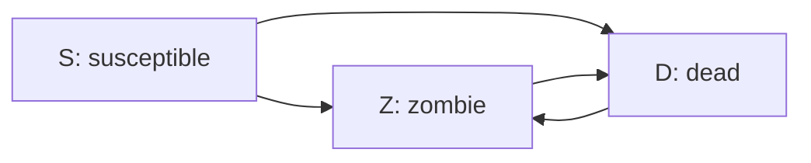

# Week 3b — The Reproduction Number and Deterministic Models

> [!abstract] Orientation — read this first (~1 min)
> **The problem this lecture solves.** Week 3a showed that roughly half of identical SIR runs
> produce no outbreak at all, without saying why. This lecture supplies the quantity that
> explains it, and with it the analytical results — the epidemic threshold, the final attack
> rate, the vaccination coverage requirement — that make a disease model into a policy
> instrument.
>
> **Core claims**
> 1. The reproduction number $R$ is the average number of secondary cases infected by a
>    typical primary case; $R_0$ is that quantity in a totally susceptible population.
> 2. For the SIR model $R_0 = \beta/\gamma$, so it is a ratio of transmission rate to recovery
>    rate and two diseases can share an $R_0$ while behaving completely differently.
> 3. $R = 1$ is a threshold: below it the outbreak dies out, above it it *may* take off. The
>    asymmetry in that wording is load-bearing.
> 4. Below the threshold, seeding with 100 infectious individuals instead of 1 does not
>    produce an outbreak — establishment depends on $R$, not on the size of the introduction.
> 5. $R$ is not directly observable and must be inferred from data.
> 6. A deterministic model gives one outcome per parameter set, is cheap and analytically
>    tractable, and cannot represent the fadeout mode or any other tail event.
> 7. The relationship between $R_0$ and the final attack rate saturates — above roughly
>    $R_0 = 4$ essentially everyone is infected, so further increases change speed rather than
>    reach.
> 8. The vaccination coverage needed to prevent an outbreak is $v \ge 1 - 1/R_0$, which rises
>    steeply and is why highly transmissible diseases return first when coverage slips.
>
> **Prerequisites.** [[sir-model]], [[compartmental-model]], [[stochasticity]],
> [[w03a-analysing-models]] — particularly the bimodal output distributions.
> **Where it sits.** The last lecture on general modelling and the last on epidemics in
> detail. Game-theoretic models follow from Week 6, network models Week 7, model evaluation
> from Week 8. Directly supports Assignment 1, whose rubric was released at the start of this
> session.
> **Sources.** Deck (23 slides) + recording · **digest read time ~16 min**

> [!warning] A note on anchors
> As with [[w03a-analysing-models-digest]], the supplied transcript carries no time markers
> and no recording URL is recorded on the source page, so sections are anchored by slide
> number and lecture position rather than by timestamp.

> [!warning] The recording and the slides disagree
> Four discrepancies, with the slides taken as authoritative throughout this digest:
>
> | Point | Recording | Slide |
> |---|---|---|
> | Fadeout example recovery rate | $\gamma = 1.4$ | $\gamma = 0.4$ |
> | COVID-19 delta $R_0$ | ≈ 6 | band ≈ 5–8 |
> | COVID-19 alpha $R_0$ | ≈ 4 | band ≈ 4–5 |
> | Measles / chickenpox coverage | "about 90%" both | 93.75% / 87.5% |
>
> The recording also describes the attack-rate curve as "logarithmic". It is not — it is a
> saturating curve arising from the final-size relation, which has a different shape and a
> different origin.

---

## The Spine

### The basic reproduction number
`slides 2–3` · opening

The slide's definitions, reproduced as stated:

> A key concept in infectious disease epidemiology is the **reproduction number** ($R$),
> often defined as the average number of secondary cases infected by a typical primary case.
>
> The **basic** reproduction number ($R_0$) is the average number of secondary cases infected
> by a typical primary case in a **totally susceptible** population.

$$R_0 = \frac{\beta}{\gamma}$$

And the threshold:

- If $R < 1$, the outbreak will die out.
- If $R > 1$, the outbreak **may** take off.

That asymmetry is deliberate and it is the seam connecting this lecture to the previous one.
Below one, extinction is assured. Above one, an outbreak is only *possible*, because early
transmission is stochastic and a chain can fail by chance before it establishes — which is
exactly the [[stochastic-fadeout]] that produced the 45% spike at zero in
[[w03a-analysing-models]].

Slide 3 renders this as two generation trees. On the left, $R_0 > 1$: generation 0 is one
infected case, generation 1 has three, generation 2 has more, and arrows continue off the
diagram — a widening cascade with a few uninfected nodes scattered through it. On the right,
$R_0 < 1$: the same starting case, but most nodes at each generation are uninfected and the
tree narrows to nothing. Reading $R$ as the average branching factor of this tree is the most
useful intuition in the lecture.

> [!mic] Not on the slides — why $R$ is hard to know
> The lecturer opened by framing $R$ as "actually one parameter that is actually
> non-observable. We cannot really tell this, but eventually with enough data we might get
> some estimates of what this is."
>
> The reason: "it's hard to identify, for example, how many people you might contact with,
> how many people you might encounter, and therefore they got sick because of you." Measuring
> $R$ directly would require a complete contact log plus attribution of each infection to a
> specific transmitting contact. Neither is available, so published values are inferred, vary
> between sources, and get revised. Treat any specific $R_0$ figure as an estimate with a
> confidence interval, not a constant of nature.

> [!mic] Not on the slides — $R = 1$ as a critical point
> The lecturer explicitly connected this back to the segregation model from Tuesday. At a 30%
> similarity threshold the model converged nicely; at 90% it produced nothing; somewhere
> around 70% there was a point where the system converged to a stable state.
>
> "Points where you shift from one state to another is usually what we call like critical
> points, phase transition points — they have different names, but generally they are those
> where one type of dynamics occurs and after that, a whole totally different dynamics
> appears." $R$ is one of those values, and it has been studied deeply enough that the
> threshold is known precisely. See [[tipping-point]].

### Below the threshold: outbreaks that cannot establish
`slides 4–5` · early

Configuration: $N = 10{,}000$, $\beta = 0.25$, $\gamma = 0.4$, 25 simulations. This gives
$R_0 = 0.625$, slightly below one.

**Slide 4 — one initial infectious person.** Most trajectories rise to fewer than 10
infectious and die within 30 steps. Two outliers do better: one reaches about 20 infectious
around step 35, and one reaches about 50 around step 45 before declining to zero by step 85.
All are extinct well before step 100. The slide's caption: *even with plenty of susceptible
people to infect, a disease with $R_0 \le 1$ will struggle to persist.*

**Slide 5 — one hundred initial infectious people.** The obvious hypothesis is that a larger
seed overcomes the deficit. It does not. All 25 trajectories decline monotonically from 100
toward zero, with the slowest extinct by about step 115. The slide's caption: *outbreaks can
fade out even when the initial number of infectious people is relatively large (100 people).
For example, H5N1 influenza can spread from birds to humans, but is not usually
human-transmissible.*

This is the cleanest result in the lecture. Outbreak establishment is governed by the
reproduction number, not by the size of the introduction. A hundred independent
introductions, each with $R_0 < 1$, is a hundred chains that each shrink.

> [!mic] Not on the slides — the common cold, and why influenza needs a yearly shot
> The lecturer's household intuition for $R_0 \approx 1$: "have you noticed that when you get
> the cold, usually just one other person gets the cold out of you if you are in a house. I
> get there and I have my kids and my kids usually always infect one — either me or my wife,
> but it never gets to everybody."
>
> He also raised avian influenza in poultry a couple of years ago, where flocks were culled
> and the price of eggs rose as an unintended consequence, and noted approvingly that a
> previous year's student group had modelled exactly that price effect for their assignment.
> Offered as a prompt for assignment topics: the disease model is not obliged to be about the
> disease.

### Why stochastic, why deterministic
`slides 6–7` · early-middle

Slide 6 poses the question rather than answering it: as population size increases the
influence of chance diminishes, so perhaps we can ignore stochasticity altogether if the
population is large enough? When does stochasticity matter?

> [!mic] Not on the slides — black swans
> The class discussion produced the real argument. Asked why we want stochastic models, a
> student offered that real life contains randomness. The lecturer pushed for more and
> introduced black swans: "basically because we care about tail events."
>
> His reasoning, which is the justification for the whole of Tuesday's lecture: "sometimes if
> we look at the mean, this is going to be deceiving, and if we look at the tail events, we
> start to see that there are high impact elements. So one of the reasons that we wanted
> stochastic models is precisely to observe those sort of tail events."
>
> The counterweight came immediately: "sometimes in some occasions we actually want to see
> kind of the average outcome, maybe because we want to understand sort of like the typical
> case, or maybe because we want to do an analysis of the mathematics more deeply."
>
> He also flagged this as a one-off: a student had asked earlier whether they would need to
> derive model parameters mathematically, and the answer was no — "this is the only lesson
> that we talk about this."

Slide 7 states the alternative:

> An alternative to stochastic models, which generate distributions of **potential**
> outcomes, is deterministic models, which generate **unique** outcomes based on a given set
> of parameters and initial conditions.
>
> Unlike stochastic models, for each state of a deterministic model, there is only **one**
> possible future state.
>
> If we are happy to ignore the variability in potential epidemic outcomes, we can set up a
> model that efficiently simulates the **average** behaviour of a system.

"If we are happy to" is doing the work. [[w03a-analysing-models]] established the conditions
under which you should not be happy to: when the outcome distribution is bimodal, the average
behaviour is a behaviour the system does not exhibit.

### Functions and iteration
`slide 8` · middle

The build-up to the equations, reproduced as stated.

A **function** takes a number as an input, does something to it, and produces a number as an
output; e.g. $f(x) = 3x$. The function $f$ takes $x$ as an input, multiplies it by 3, and
returns the resulting value as an output.

**Iteration** is simply using the output of the previous application of a function as the
input for the next application:

$$[x_0,\; f(x_0),\; f(f(x_0)),\; f(f(f(x_0))),\; \ldots]$$

The slide's note: this function and sequence can also be written as

$$x_{t+1} = 3x_t \qquad \text{over} \qquad [x_0, x_1, x_2, x_3, \ldots, x_t]$$

That rewrite is the whole content of the slide. Once a model is expressed as $x_{t+1}$ in
terms of $x_t$, it is a [[difference-equation]] and the machinery of dynamical systems
applies to it.

> [!mic] Not on the slides — where you have seen this before
> The lecturer connected it to time series: "if you remember in time series analysis when we
> are doing these simple moving average models, we tend to have also the past inputs to the
> model as part of our entry to our system." The defining feature of a dynamical model is
> that "what the past has produced also has an influence in the future results."
>
> He also picked up a student observation from the previous week that the SIR diagram looks
> like a Markov process, and agreed: you can think of these as state machines moving between
> states with given probabilities, but here we represent them as difference equations instead.

### The deterministic SIR model
`slide 9` · middle

The central slide of the lecture. Reproduced in full.

**State.** $S_t$, $I_t$ and $R_t$ are the number of susceptible, infectious and recovered
people at time $t$.

**Rules.** We use mathematical functions to specify how the state of the system at time $t$
changes at time $t + \Delta t$. By convention we often say $\Delta t = 1$ timestep, the
length of which we then choose (e.g. 1 day, 1 week, 6 hours).

$$S_{t+1} = S_t - \beta S_t I_t$$
$$I_{t+1} = I_t + \beta S_t I_t - \gamma I_t$$
$$R_{t+1} = R_t + \gamma I_t$$

**Parameters.** $\beta$ and $\gamma$ are now the **rates** of effective contact (per capita)
and recovery.

The accompanying compartment diagram:

Two things to notice about the equations. First, each flow term appears exactly twice with
opposite signs — $\beta S_t I_t$ leaves $S$ and enters $I$; $\gamma I_t$ leaves $I$ and enters
$R$. That is what conserves the total population, and it is a useful check on any compartment
model you write ([[compartmental-model]]).

Second, and emphasised by the slide's own bolding: $\beta$ and $\gamma$ are **rates now**.
This is the third distinct meaning the symbols have carried in three weeks.

| Formulation | $\beta$ / $q$ | $\gamma$ |
|---|---|---|
| Week 2 ABM | $q$ = probability of transmission per contact | probability of recovery per day |
| Week 3a stochastic | $\beta$ = mean contacts per unit time $\times\, q$ | recovery rate |
| Week 3b deterministic | $\beta$ = per-capita rate of effective contact | per-capita recovery rate |

A value carried across these without re-derivation will be wrong. This is the single most
error-prone point in the epidemic material.

### Recovery rate and duration of infection
`slide 10` · middle

The inverse of a rate is the average time until something occurs, so $D = 1/\gamma$ is the
average length of time that someone is infectious.

The slide's worked reading, both directions:

- If the rate of recovery is $1/4$ per day, we would expect an infected person to experience
  one recovery every four days.
- Alternatively, on any given day, we would expect $1/4$ of the infected population to
  recover.

Those are the same statement about a rate, read at the individual and the population level.
Being able to move between the two readings fluently is what the slide is for.

### Running it
`slides 11–12` · middle-late

**Slide 11.** The equations can be set up very simply in a spreadsheet, or a package such as
R or MATLAB. The plotted output at $N = 100{,}000$ is a single smooth curve peaking near
48,000 infectious around step 80 — no jaggedness, no run-to-run spread. The slide's note:
*unlike the stochastic model, each time we run the deterministic model we get the same
result.*

Compare this directly against slide 18 of [[w03a-analysing-models]], which is the stochastic
version at $N = 1{,}000{,}000$: same characteristic shape, comparable relative peak, but
spread across timing and with a population of runs sitting flat at zero. The deterministic
curve is one of those trajectories with the variation and the fadeout mode removed.

**Slide 12.** Models are often written as differential rather than difference equations.
Rather than describing how a system changes in discrete time steps, they describe how a
system changes continuously:

$$\frac{dS}{dt} = -\beta S I, \qquad \frac{dI}{dt} = \beta S I - \gamma I, \qquad
\frac{dR}{dt} = \gamma I$$

The slide's note: models often describe the **fraction** of the population in each
compartment; i.e. $S + I + R = 1$.

The compartment diagram on this slide labels the arrows $\beta I$ and $\gamma$ rather than
$\beta SI$ and $\gamma I$ — per-capita rates rather than absolute flows. Both labellings
appear in the deck; read the arrow label against the equations on the same slide rather than
assuming.

### The reproduction number and outbreak size
`slide 13` · late

The payoff for having an analytically tractable model. The plot shows the fraction infected
by the end of an outbreak — the **final attack rate** — against $R_0$ from 0 to 5.

Shape, read off the curve:

- $R_0 < 1$: the region is shaded and labelled **No Epidemic**. Fraction infected is zero.
- $R_0 = 1$: the curve leaves zero, steeply.
- $R_0 = 2$: roughly 0.8 of the population infected.
- $R_0 = 3$: roughly 0.94.
- $R_0 = 4$: roughly 0.98.
- $R_0 = 5$: approaching 1.

The lecturer's emphasis, elicited from the class: between 1 and 2 there is a huge jump, "you
basically go from no people to about half of the people, maybe 60% of the people infected."
And past 4, "everybody gets the disease — it's like almost for certain that everybody gets
it."

The consequence is worth stating plainly, because it is counter-intuitive. Increasing $R_0$
from 4 to 16 barely changes how many people are eventually infected. What it changes is how
fast the outbreak arrives and how high it peaks — which is exactly what the next four slides
separate out.

### Four disease profiles
`slides 14–17` · late

> [!example] Worked example — reading four deterministic SIR runs
> All at $N = 1000$, each showing $S$ (blue), $I$ (red) and $R$ (green) over 50 days.
> Reproduced completely, because the comparison across the four is the content.
>
> | Slide | Disease | $R_0$ | $\gamma$ | $1/\gamma$ | Peak $I$ | Peak day | State at $t = 50$ |
> |---|---|---|---|---|---|---|---|
> | 14 | measles-like | 16 | 0.14 | 7 days | ~760 | ~5 | fully recovered, $S \approx 0$ |
> | 15 | chickenpox-like | 8 | 0.14 | 7 days | ~620 | ~9 | fully recovered, $S \approx 0$ |
> | 16 | mumps-like | 8 | 0.07 | 14 days | ~620 | ~18 | $R \approx 920$, $I \approx 80$ still infectious |
> | 17 | smallpox-like | 4 | 0.07 | 14 days | ~400 | ~38 | $R \approx 650$, $I \approx 280$, $S \approx 80$ — still running |
>
> **14 → 15, halving $R_0$ at constant duration.** Peak drops from ~760 to ~620 and moves from
> day 5 to day 9. Both still infect essentially everyone. The lecturer: measles is "very
> infectious and it takes a long time" to recover, so "almost everybody gets it and it's very
> quick." For chickenpox, "it is less virulent, but still you get the disease for relatively a
> long time, so you can spread it still" — about 10 days for most people to be infected.
>
> **15 → 16, doubling duration at constant $R_0$.** The peak height is unchanged at ~620 but
> moves from day 9 to day 18, and the decline is far slower — 80 people are still infectious
> at day 50 where chickenpox had finished. A student read the implication straight off the
> plot: "the infected has more area, it's just more resources going to be used." The
> lecturer's version: "if I think about the hospital, it means that I'm gonna get beds used
> for longer."
>
> **16 → 17, halving $R_0$ again at long duration.** Peak falls to ~400 and moves to day 38.
> A student asked whether, since $R_0 = 4$, everyone gets infected eventually anyway. The
> answer was yes — but much slower. And that slowness is the point: "I have about 20 days to
> catch up... maybe if I come up with some sort of intervention, I can delay this even
> further."
>
> **The named lesson.** "This is what they say when they are talking about **flattening the
> curve**." The intervention target is peak height and peak timing, not final size
> ([[outbreak-summary-measures]]).

The comparison across slides 15 and 16 is the most examinable thing in the lecture: two
diseases with identical $R_0$, identical peak heights and identical eventual reach, producing
completely different demands on a health system because the infectious period differs. $R_0$
alone does not determine the shape of an outbreak.

> [!mic] Not on the slides — measles in Texas
> The lecturer attributed the recent Texas measles outbreak to a concentration of communities
> declining vaccination, with coverage falling to around 70% against a requirement he stated
> as 90%. The slide-derived figure is 93.75% at $R_0 = 16$; either way the gap is what matters
> and the mechanism is the [[herd-immunity-threshold]] being breached. He was careful to note
> he did not know the reasons behind the refusals.

### Two questions
`slide 18` · late

The slide is two lines, and they are the framing for the rest of the lecture:

- What is the reproduction number of an outbreak of a particular disease in a particular
  population?
- How many people do we need to vaccinate to prevent an outbreak?

The first is an estimation problem and is genuinely hard — the lecturer noted $R$ depends on
cultural aspects of how often you meet people, whether you are a partygoer, how much public
transport you use. The second has a clean answer, which is the next slide.

### Preventing outbreaks with vaccination
`slides 19–20` · close

**Slide 19.** The generation diagram from slide 3, redrawn with some nodes marked as
vaccinated. On the left, the original $R_0 > 1$ cascade. On the right, the same cascade with
vaccinated nodes in generation 1 and beyond: the arrows out of vaccinated nodes become dotted
and the tree collapses. The slide's text:

> One way that vaccinations can protect people is by preventing them from becoming infected;
> this is equivalent to moving them from the **S** into the **R** compartment.

That equivalence is the modelling move. It is deliberately crude — it assumes perfect,
immediate efficacy — and it is adequate only for asking about coverage thresholds.

**Slide 20.** The herd immunity threshold, stated as:

$$v \ge 1 - \frac{1}{R_0}$$

with the note that the coverage needed to prevent an outbreak increases with $R_0$.

The derivation is one line and worth carrying: if a fraction $v$ is immune, only $(1-v)$ of
contacts are susceptible, so the effective reproduction number is $R_0(1-v)$. Set
$R_0(1-v) < 1$ and solve.

Threshold values marked on the chart:

| $R_0$ | HIT | | $R_0$ | HIT |
|---|---|---|---|---|
| 1 | 0% | | 5 | 80% |
| 1.25 | 20% | | 8 | 87.5% |
| 1.6 | 37.5% | | 10 | 90% |
| 2 | 50% | | 12.5 | 92% |
| 2.5 | 60% | | 16 | 93.75% |
| 4 | 75% | | 20 | 95% |

Disease bands marked on the same chart:

| Disease | $R_0$ band |
|---|---|
| Influenza | ~1–2 |
| SARS | ~2–4 |
| COVID-19 ancestral strain | ~2.5–3 |
| COVID-19 alpha variant | ~4–5 |
| COVID-19 delta variant | ~5–8 |
| Polio | ~5–8 |
| Chickenpox | ~10–12 |
| Measles | ~12–18 |

The shape of the curve is the policy content. It is steep at low $R_0$ and flat at high
$R_0$, so a disease at $R_0 = 2$ tolerates half the population being susceptible while
measles leaves under 7% of slack. Highly transmissible diseases are the first to return when
coverage slips.

> [!mic] Not on the slides — modelling vaccination properly, and annual flu shots
> Asked how to implement vaccination in the assignment model, the lecturer gave both the cheap
> and the honest version. Cheap: "just basically move them from the susceptible to the
> recovered." Honest: "I could just create another state where I have the possibility of being
> infected, but the possibility is probably smaller." Either way, "what I'm trying to do is to
> reduce the $R_0$ to less than 1."
>
> He noted explicitly that the assignment requires adding a state, so the $S \to R$ transfer
> alone will not satisfy it.
>
> On annual influenza vaccination, the class produced three reasons and all three are correct:
> the virus mutates, immunity wanes, and there are multiple circulating strains. The
> operational detail he added: each year's vaccine targets the strains predicted to be most
> common, "but that is just an estimation based on what they know, so there is still a
> probability that they don't get it right."

### Zombie apocalypse, second pass
`slides 21–22` · close

The design exercise from Week 2b returns, aimed at questions and interventions rather than
structure. Slide 21 restates what is known about zombies:

- Susceptible humans can die (be **Removed**) due to natural causes.
- **Removed** humans can reanimate and become **Zombies**.
- **Susceptible** humans bitten by a zombie can become infected and turn into **Zombies**.
- **Susceptible** humans can defeat **Zombies**, who then return to being **Removed**.

Slide 22 shows the state diagram — $S \to Z$, $Z \leftrightarrow D$, and $S \to D$ — and asks
three questions: what science or policy question would you address with this model, what
would you need to add to answer it, and what information would you need to collect from the
model?

> [!example] Worked example — the class discussion, reconstructed
> **The structural bug found first.** A student proposed cutting the $D \to Z$ arrow. The
> lecturer redirected: that arrow is the point of the model — susceptible humans die, get
> cursed, and reanimate. The actual problem is that $Z \leftrightarrow D$ is a **closed loop**,
> so a destroyed zombie can reanimate forever. The fix is a **permanently dead** state. This
> is the same compartment-splitting move the Week 2b exercise made
> ([[zombie-apocalypse-model-design]]).
>
> **Question 1 — "maintain a sustainable ratio of humans to zombies."** Rejected as stated.
> The lecturer: "Is that question tractable? Can you answer it? Maybe you need to be more
> specific." A [[research-question]] has to be bounded before it can be answered.
>
> **Question 2 — isolation.** "If we isolate people, can we reduce the infection rate?"
> Implementation: add a non-susceptible state. The lecturer immediately probed the degenerate
> case — if everybody goes into that state the outbreak dies out trivially — so the state needs
> a **capacity limit**. That reframes the question into something answerable: what safe-zone
> capacity is needed? Outputs to track: remaining capacity.
>
> **Question 3 — cremation.** "What would be the impact of cremating corpses?" Implementation:
> a state that cannot reanimate. Outputs: total cremated. The lecturer added a constraint the
> student had not: there must be **people available** to carry out the cremation, so the
> intervention consumes the population it is protecting. (He offered decapitation as the
> alternative mechanism, on the same principle.)
>
> **Question 4 — "what's the minimum rate at which people defeat zombies so that zombies die
> off?"** The lecturer identified a hidden assumption: this presumes zombies die out naturally.
> "What do the zombies need to keep going?" If they need to feed, that is a mechanism the model
> does not currently contain, and the question cannot be answered without adding it.
>
> **The transferable pattern.** Every question the class proposed was improved the same way:
> bound it, identify the state or mechanism it requires, and name the variable that answers it.
> That triple — question, structure, measurement — is what the assignment is marked on.

### Next steps
`slide 23` · close

The assignment pointer: for further ideas about how you might modify the basic SIR model, look
at the HIV model in the NetLogo Models Library under Biology, which is a very different disease
system but includes several aspects of behaviour that interact with and affect transmission
characteristics ([[netlogo-hiv-model]]).

The lecturer noted the Models Library has a search box at the bottom, and that library models
carry an Info tab describing the model in plain language alongside the code — "not quite an ODD
sort of implementation but enough for you to maybe get some ideas." HIV is worth the detour
specifically because it uses explicit partner pairings rather than undifferentiated contact,
which is a structural departure from the well-mixed assumption ([[contact-rate]]).

> [!mic] Not on the slides — the marking rubric
> Released at the start of this lecture in response to feedback that marking was ambiguous.
> The lecturer's summary of what it rewards: "I said that in this subject we do a little bit
> less coding. There is less coding involved than perhaps in other ones, but what we're looking
> is more about your ability to think about the processes. We are very interested in how do you
> abstract the system, what is the question that you have, and then how do you explain, how do
> you decide what the experiments are meaningful and how do you present your results."
>
> Four assessed things: abstraction, question formulation, experiment design, presentation of
> results. Code volume is not among them.

---

## Recall Layer

> [!question]- State the definitions of $R$ and $R_0$ precisely, and say what distinguishes
> them.
> $R$ is the average number of secondary cases infected by a typical primary case. $R_0$ is
> the same quantity in a **totally susceptible** population. The distinction matters as soon
> as anyone is immune: once a fraction $v$ of the population is immune, the effective
> reproduction number falls to $R_0(1-v)$, which is the mechanism behind the herd immunity
> threshold. `slide 2`

> [!question]- Why is "$R > 1$ means the outbreak will take off" wrong, and what is the
> correct statement?
> The correct statement is that it **may** take off. $R_0$ is an average, and early in an
> outbreak the infectious pool is tiny, so the realised number of onward infections is a small
> sample from a distribution with mean $R_0$ — and small samples can come out at zero. If the
> index case recovers before infecting anyone, the chain ends regardless of transmissibility.
> This is [[stochastic-fadeout]], and at $R_0 = 6.25$ it accounted for roughly 45% of runs in
> [[w03a-analysing-models]]. The reverse direction is not symmetric: below one, extinction is
> assured. `slide 2`

> [!question]- Two diseases both have $R_0 = 8$. What can you conclude about how their
> outbreaks will look, and what can you not?
> You can conclude they will infect a similar fraction of the population eventually — the
> final attack rate is a function of $R_0$. You cannot conclude anything about the shape or
> timing. The lecture's chickenpox-like ($\gamma = 0.14$) and mumps-like ($\gamma = 0.07$)
> profiles share $R_0 = 8$ and a peak near 620, but peak at day 9 and day 18 respectively, and
> the mumps-like profile still has 80 people infectious at day 50 where the other has
> finished. $R_0 = \beta/\gamma$ is a ratio, so the same value arises from a transmissible
> short infection or a milder long one. `slides 15–16`

> [!question]- Runs with $R_0 = 0.625$ starting from 100 infectious individuals still die out.
> What does that establish?
> That outbreak establishment is governed by the reproduction number, not by the size of the
> introduction. A hundred introductions with $R_0 < 1$ is a hundred chains that each shrink
> generation by generation. The real-world analogue given was H5N1 influenza: repeated
> bird-to-human introductions that do not sustain human-to-human transmission. `slide 5`

> [!question]- Why can't $R$ be measured directly?
> It would require a complete log of who each case contacted, plus attribution of each new
> infection to a specific transmitting contact. Neither is obtainable — contact patterns depend
> on unobserved behaviour (public transport use, socialising) and transmission attribution is
> usually impossible after the fact. $R$ is therefore inferred from case data, which is why
> published values differ between sources and get revised. `slide 2, transcript`

> [!question]- Give the deterministic SIR difference equations from memory, and explain what
> the repeated terms are doing.
> $S_{t+1} = S_t - \beta S_t I_t$; $I_{t+1} = I_t + \beta S_t I_t - \gamma I_t$;
> $R_{t+1} = R_t + \gamma I_t$. Each flow term appears exactly twice with opposite signs —
> $\beta S_t I_t$ leaves $S$ and enters $I$, $\gamma I_t$ leaves $I$ and enters $R$ — which is
> what conserves the total population. A compartment model whose terms do not pair up this way
> is leaking people. `slide 9`

> [!question]- $\beta$ has meant three different things across weeks 2 and 3. State all three
> and say why it matters.
> Week 2 ABM: $q$, the probability of transmission in a single contact. Week 3a: $\beta$ =
> mean contacts per person per unit time $\times\, q$, an effective contact rate. Week 3b
> deterministic: $\beta$ = per-capita rate of effective contact, appearing in a flow term
> $\beta S I$. Carrying a numerical value across these without re-deriving it produces wrong
> dynamics, and the slide bolds "**rates**" precisely because the meaning has shifted.
> `slide 9`

> [!question]- $\gamma = 0.07$. State two equivalent readings of what that means.
> Individual level: the average infectious period is $D = 1/\gamma \approx 14$ days.
> Population level: on any given day, about 7% of the infectious population recovers. These
> are the same statement about a rate read at two levels, and moving between them fluently is
> what the slide exists to teach. `slide 10`

> [!question]- Under what circumstances would you deliberately choose a deterministic model
> over a stochastic one, and what are you accepting when you do?
> When you want the typical or average trajectory, when you need analytical tractability, or
> when cost matters — a deterministic model runs once rather than hundreds of times and yields
> closed-form results like $R_0 = \beta/\gamma$ and $v \ge 1 - 1/R_0$. You accept that tail
> events become invisible: the model produces an outbreak every time $R_0 > 1$, so the entire
> fadeout mode is unrepresentable, and any question about the *probability* of an outcome
> cannot be asked. `slides 6–7`

> [!question]- Describe the shape of the final attack rate as a function of $R_0$, and state
> the practical consequence.
> Zero below $R_0 = 1$ (the "No Epidemic" region), then a steep rise between 1 and 2 reaching
> roughly 0.8, then saturation — about 0.94 at $R_0 = 3$ and 0.98 at $R_0 = 4$, approaching 1
> thereafter. The consequence is that raising $R_0$ from 4 to 16 barely changes how many people
> are eventually infected; it changes how fast the outbreak arrives and how high it peaks.
> Above about $R_0 = 4$, "everybody gets it" and the remaining variation is entirely in timing
> and peak load. `slide 13`

> [!question]- What does "flattening the curve" target, and why is that different from
> reducing the total number of infections?
> It targets peak size and peak timing, not final size. The smallpox-like profile
> ($R_0 = 4$, 14 days) still infects most of the population, but peaks around day 38 at ~400
> infectious rather than day 5 at ~760. That buys preparation time and reduces simultaneous
> demand on the health system without necessarily changing the eventual total. Since the
> attack rate saturates, for a transmissible disease the peak is often the only thing an
> intervention can realistically move. `slides 14–17`

> [!question]- Derive $v \ge 1 - 1/R_0$ in one line.
> If a fraction $v$ of the population is immune, only $(1-v)$ of a case's contacts are
> susceptible, so the effective reproduction number is $R_0(1-v)$. Requiring
> $R_0(1-v) < 1$ gives $1 - v < 1/R_0$, hence $v > 1 - 1/R_0$. `slide 20`

> [!question]- Measles has $R_0 \approx 16$ and influenza $R_0 \approx 1.5$. Compute the
> coverage each requires and explain the policy asymmetry.
> Measles: $1 - 1/16 = 93.75\%$. Influenza at 1.5: $1 - 1/1.5 \approx 33\%$. The curve is
> steep at low $R_0$ and flat at high $R_0$, so influenza tolerates two-thirds of the
> population being susceptible while measles leaves under 7% of slack. Highly transmissible
> diseases are the first to return when coverage slips — which is the mechanism behind the
> Texas measles outbreak. `slide 20`

> [!question]- Vaccination is modelled as moving individuals from $S$ to $R$. What does that
> representation assume, and what would you change to represent an imperfect vaccine?
> It assumes the vaccine is perfectly and immediately effective, and it cannot represent waning
> immunity. It is adequate only for asking about coverage thresholds. An imperfect vaccine
> needs a **separate state** with a reduced infection probability rather than a transfer to
> $R$ — which is a structural change to the compartment diagram, and the lecturer noted the
> assignment requires adding a state, so the transfer alone will not satisfy it. `slide 19`

> [!question]- The zombie state diagram has $Z \to D$ and $D \to Z$. What is wrong with that,
> and what does fixing it require?
> It is a closed loop, so a destroyed zombie reanimates indefinitely and the population never
> resolves. Fixing it requires a **permanently dead** state that cannot re-enter $Z$ — the
> same compartment-splitting move as distinguishing died-naturally from destroyed-after-
> reanimating. `slide 22`

> [!question]- "How can I maintain a sustainable ratio of humans to zombies?" was rejected as
> a research question. Why, and what does a usable version look like?
> It is not tractable as stated — no measurement answers it and no bound tells you when you
> have succeeded. The usable versions the class reached all bound the scope and name a
> measurable: what safe-zone **capacity** is required to keep the human population above some
> level, or what **impact** does cremating corpses have on the zombie population. The pattern
> is: bound the question, identify the state or mechanism it needs, name the variable that
> answers it. `slide 22`

> [!failure] Common failure modes
> - **Reading $R > 1$ as a guarantee.** It is a necessary condition for an outbreak, not a
>   sufficient one. The asymmetry with $R < 1$ (which *is* decisive) is the point.
> - **Reusing $\beta$ or $\gamma$ across formulations.** Three distinct meanings in three
>   weeks. Re-derive from the definition every time.
> - **Assuming $R_0$ determines the outbreak shape.** It determines the eventual reach. Peak
>   height and timing depend on $\beta$ and $\gamma$ separately, which is the entire content of
>   the chickenpox-versus-mumps comparison.
> - **Thinking a bigger initial seed can start an outbreak below threshold.** Slide 5 exists
>   solely to kill this intuition.
> - **Inverting the herd immunity formula.** It is $1 - 1/R_0$, not $1/R_0$. A sanity check:
>   the threshold must rise toward 1 as $R_0$ grows, and be 0 at $R_0 = 1$.
> - **Treating $D = 1/\gamma$ as exact per individual.** It is a mean. In the stochastic model
>   individual durations are geometrically distributed around it.
> - **Modelling vaccination as $S \to R$ and calling it a vaccination model.** It represents a
>   perfect vaccine and answers only coverage questions. For the assignment it does not even
>   satisfy the requirement to add a state.
> - **Quoting the lecturer's spoken figures.** The recording differs from the slides on the
>   fadeout $\gamma$, COVID-19 variant $R_0$ values, and the measles/chickenpox thresholds. Use
>   the slides.
> - **Describing the attack-rate curve as logarithmic.** It is a saturating curve from the
>   final-size relation. The lecturer said "logarithmic" in the recording; it is wrong.

> [!exam] Exam surface
> - **Compute $R_0$ from $\beta$ and $\gamma$, or invert to find a parameter given $R_0$.**
>   The most mechanical thing here and near-certain to appear in some form.
> - **Compute a herd immunity threshold from $R_0$, or the $R_0$ implied by a stated
>   threshold.** Likewise. Know the derivation, not just the formula.
> - **Given two disease profiles, explain why they differ despite a shared $R_0$.** The
>   chickenpox/mumps comparison, transferred to new numbers. This tests whether you understand
>   $R_0$ as a ratio.
> - **Explain why an outbreak with $R_0 > 1$ might still fail to establish**, connecting to the
>   bimodal distributions from Tuesday. This is the question that spans both Week 3 lectures.
> - **Justify choosing a stochastic or deterministic model for a stated purpose.** Expect a
>   scenario where the wrong choice is superficially attractive.
> - **Convert between $\gamma$ and infectious duration**, and read a rate at both the
>   individual and population level.
> - **Write or complete a compartment diagram and its difference equations** for a modified
>   disease model — an added state, a vaccination flow, a death compartment.
> - **Critique a proposed research question** and improve it. The zombie discussion is a worked
>   template and the marking rubric weights exactly this.
> - **Assignment relevance.** The rubric rewards abstraction, question formulation, experiment
>   design and presentation. Slides 21–23 are effectively an assignment briefing.

> [!todo] Open threads
> - **Where $R_0 = \beta/\gamma$ comes from** is asserted, not derived. The lecture says the
>   result follows "from the analysis of this model" without performing the analysis, and
>   explicitly frames this as the only session touching mathematical derivation.
> - **The final-size relation itself** is never given. The attack-rate curve is shown as a
>   plot; the implicit equation generating it
>   ($1 - x = e^{-R_0 x}$, for what it is worth) is not stated, so the curve cannot currently
>   be reproduced from the wiki.
> - **The effective reproduction number $R_t$** — $R$ as it changes over an outbreak as
>   susceptibles deplete — is implied by the $R$ / $R_0$ distinction but never named or
>   developed. This is a live gap given how much COVID-era reporting used it.
> - **Whether the assignment expects deterministic modelling at all** is unclear. Assignment 1
>   extends the agent-based NetLogo model, and this lecture is the only deterministic content
>   in the subject.
> - **Stochastic vs deterministic threshold behaviour near $R_0 = 1$** is not addressed. The
>   deterministic model has a sharp threshold; the stochastic one has a probability of
>   establishment that rises continuously. The lecture uses one to explain the other without
>   noting they differ.
> - **The four disease profiles use a population of 1000 with no vital dynamics** (no births,
>   no deaths, no waning immunity), so "measles infects everyone in 20 days" is a property of
>   this configuration rather than of measles. The idealisation is not flagged in the lecture.

---

## Topics covered

- [x] `slide 1` — Title → *(no content)*
- [x] `slide 2` — $R$, $R_0$, $R_0 = \beta/\gamma$, threshold behaviour → [[#The basic reproduction number]]
- [x] `slide 3` — Generation diagrams, $R_0 > 1$ vs $R_0 < 1$ → [[#The basic reproduction number]]
- [x] `slide 4` — Sub-threshold dynamics, 1 initial infectious → [[#Below the threshold outbreaks that cannot establish]]
- [x] `slide 5` — Sub-threshold dynamics, 100 initial infectious; H5N1 → [[#Below the threshold outbreaks that cannot establish]]
- [x] `slide 6` — Stochastic models summary; when does stochasticity matter → [[#Why stochastic, why deterministic]]
- [x] `slide 7` — Deterministic models defined → [[#Why stochastic, why deterministic]]
- [x] `slide 8` — Functions, iteration, difference-equation notation → [[#Functions and iteration]]
- [x] `slide 9` — Deterministic SIR: state, rules, equations, parameters, diagram → [[#The deterministic SIR model]]
- [x] `slide 10` — $D = 1/\gamma$, both readings → [[#Recovery rate and duration of infection]]
- [x] `slide 11` — Running the deterministic model; identical output each run → [[#Running it]]
- [x] `slide 12` — Difference vs differential equations; $S + I + R = 1$ → [[#Running it]]
- [x] `slide 13` — Final attack rate against $R_0$; the No Epidemic region → [[#The reproduction number and outbreak size]]
- [x] `slide 14` — Measles-like, $R_0 = 16$, $\gamma = 0.14$ → [[#Four disease profiles]]
- [x] `slide 15` — Chickenpox-like, $R_0 = 8$, $\gamma = 0.14$ → [[#Four disease profiles]]
- [x] `slide 16` — Mumps-like, $R_0 = 8$, $\gamma = 0.07$ → [[#Four disease profiles]]
- [x] `slide 17` — Smallpox-like, $R_0 = 4$, $\gamma = 0.07$ → [[#Four disease profiles]]
- [x] `slide 18` — The two questions these models answer → [[#Two questions]]
- [x] `slide 19` — Vaccination as $S \to R$; generation diagram with vaccinated nodes → [[#Preventing outbreaks with vaccination]]
- [x] `slide 20` — $v \ge 1 - 1/R_0$; threshold chart with disease bands → [[#Preventing outbreaks with vaccination]]
- [x] `slide 21` — Zombie apocalypse: what we know about zombies → [[#Zombie apocalypse, second pass]]
- [x] `slide 22` — Zombie tasks: question, additions, measurements; state diagram → [[#Zombie apocalypse, second pass]]
- [x] `slide 23` — Next steps: the NetLogo HIV model → [[#Next steps]]

Transcript-only material not on any slide, all captured above: the non-observability
argument, the critical-points connection to the segregation model, the common-cold and
avian-influenza intuitions, the black swan discussion, the time-series and Markov-process
connections, the hospital-load readings of the four profiles, the Texas measles attribution,
the proper-vaccination-modelling aside, the annual flu shot explanation, the full zombie
discussion, and the marking rubric.

## Connections

`See also:` [[sources/w03b-reproduction-number]] · [[sources/w03a-analysing-models]] ·
[[w03a-analysing-models-digest]] · [[reproduction-number]] · [[herd-immunity-threshold]] ·
[[deterministic-model]] · [[difference-equation]] · [[stochastic-fadeout]] ·
[[bimodal-distribution]] · [[sir-model]] · [[compartmental-model]] ·
[[compartmental-vs-agent-based]] · [[epidemic-intervention]] · [[tipping-point]] ·
[[outbreak-summary-measures]] · [[zombie-apocalypse-model-design]] · [[netlogo-hiv-model]] ·
[[research-question]] · [[model-extension]]
