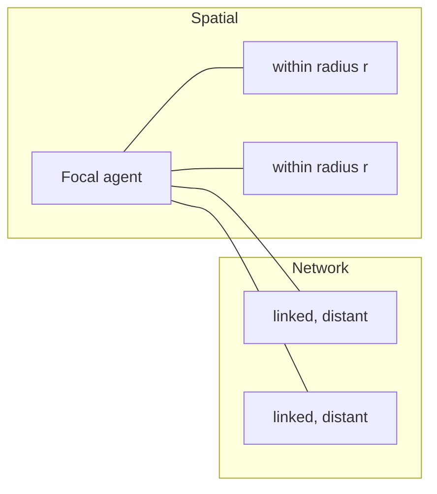

# Week 5a — Modelling Agent Behaviour: Sensing

> [!abstract] Orientation — read this first (~1 min)
> **The problem this lecture solves.** Week 4 established what a complex system is and
> why local rules are worth simulating. It left the agent as a black box. This lecture
> opens it: what information gets in, and how the ODD design concepts name each part of
> the decision machinery. After it you can write the "design concepts" section of an ODD
> without hand-waving, and specify sensing precisely enough to implement.
>
> **Core claims**
> 1. Seven ODD design concepts govern agent behaviour — sensing, adaptation, objectives,
>    learning, prediction, interaction, collectives — plus stochasticity alongside them.
>    They are a checklist, and a concept that does not apply should be declared unused.
> 2. Adaptation happens *within* a simulation run; learning carries information *across*
>    runs. Muñoz flagged this as exam material.
> 3. Sensing decomposes into three questions: what information, from which entities, and
>    how reliably obtained.
> 4. State variables have four scopes — global, local environmental, agent, and model
>    parameters — and the scope decides where the variable lives in a NetLogo model.
> 5. Real agents observe partially and imperfectly, in four distinguishable ways: limited
>    range, limited set of other agents, limited set of variables, and error that may be
>    random noise or systematic bias.
> 6. Neighbourhoods come in two shapes: spatial (radius or grid) and network. A network
>    neighbour need not be anywhere near you.
> 7. An ABM is a framework for evaluating what imperfect decision-making does to a
>    system — which only works if the imperfection is actually modelled.
>
> **Prerequisites.** [[odd-protocol]], [[agent-based-model]], [[complex-system]],
> [[cellular-automaton]], [[lotka-volterra-model]].
> **Where it sits.** Follows Week 4's complex-systems framing; the second half sets up
> [[w05b-adaptation-and-objectives]], which runs experiments on the model introduced here.
> The prescribed reading, [[kennedy-2012-modelling-human-behaviour]], supplies what goes
> *inside* the rules this lecture only names.
> **Sources.** Deck (16 slides) + recording (~50 min) · **digest read time ~11 min**

---

## The Spine

### Week 4 revision: what emergence is, and is not
`no slides` · `04:06–13:20`

The lecture opens with polling questions, and the wrong answers are more instructive than
the right one.

**What does emergence mean?** The offered options were self-similarity at different
scales, non-trivial relationships, an increase in size or number, and "how a process comes
into being". The answer is **non-trivial relationships**. Self-similarity across scales is
what a fractal has — zoom into the Mandelbrot set and you see the large structure repeated
— and that is not emergence. Emergence is that observing an individual does not let you
characterise what the group will do: watch one ant, or one bird, and the colony's or
flock's behaviour is not deducible. "Non-trivial" means precisely *not mathematically
deducible from the individual rule*. See [[emergence]].

**Which of these are self-organisation?** Zebra stripes, synchronised clapping and traffic
jams are; automated car assembly and supermarket shelf layout are not. The test is whether
a central authority planned it. An assembly line has a controller and pre-programmed
machines. Shelf layout has a manager deciding that the milk goes at the back and the
low-margin products go on the bottom shelf. Nobody conducts a crowd into clapping in
unison, and no one plans a traffic jam. See [[self-organisation]] and
[[decentralisation]].

**What is an automaton?** Not "a theoretical machine that acts independently of its
environment" — an automaton acts *on input from* its environment. In a
[[cellular-automaton]] the neighbouring cells are other automata, but from any one cell's
point of view they constitute its environment.

### Counting CA rules in general
`no slides` · `13:23–16:30`

The question everyone got wrong. Binary elementary CA with a 3-cell neighbourhood gives
$2^{2^3} = 256$ possible rule tables, which is where "rule 30", "rule 90" and "rule 110"
come from — take the 8-bit output string and read it as an integer. Now make it three
states over the same 3-cell neighbourhood. How many rules?

Generalise. With $S$ states and $N$ cells in the neighbourhood, there are $S^N$ distinct
neighbourhood configurations, and each maps independently to one of $S$ outputs:

$$\text{number of rule tables} = S^{S^{N}}$$

For $S=3$, $N=3$: $3^{27} \approx 7.6 \times 10^{12}$. Muñoz's phrasing was that this
"grows super-geometrically" — the exact term is doubly exponential in the neighbourhood
size. The point is the one Week 4 kept making from the other direction: very few moving
parts generate an enormous space of possible behaviour.

> [!mic] Not on the slides — `14:50`
> "If in the exam I ask you, which if you have rule 70, what is the output of this
> cellular automata? — you know what it will mean." Rule-number-to-behaviour decoding is
> live exam surface, and the generalised count is the natural follow-up question.

### Predator-prey, revisited in NetLogo
`no slides` · `16:35–23:40`

A recap of the Week 4 cellular-automaton predator-prey model, then the same system built
a completely different way: NetLogo's **Wolf Sheep Predation** library model, where the
environment is patches and both species are turtles.

Two demo runs went the same way. Without grass, the sheep population went exponential —
at one point Muñoz remarked he had never seen it happen quite like that. The diagnosis,
elicited from the room: **only the wolves starve**. Grass has no effect on sheep, so
nothing bounds sheep growth, and the wolves cannot eat them down fast enough.

Switch grass on as a consumable resource, so sheep can only live if they consume enough,
and the coupled oscillations appear: one population rises, the other rises behind it on
the increased food supply, then the first crashes from over-predation.

The lesson lands on model structure rather than parameters. The Week 4 CA version *cannot*
grow exponentially, because the grid itself bounds the resource — a cell holds one
occupant, so the rules impose a carrying capacity for free. The NetLogo version has no such
bound until you add a third entity to supply one. Same phenomenon, different route; and
the route determines which dynamics are even reachable. See [[lotka-volterra-model]] and
[[model-structure]].

> [!mic] Not on the slides — `16:50`
> Asked whether multiple foxes can eat the same rabbit in a discrete-step model: "that is
> basically a racing condition. You have to block a resource in order to be able to make
> it available." Simultaneous claims on a shared resource are a [[scheduling]] decision,
> not an implementation detail.

---

### The ODD design concepts, as a checklist
`slides 2–5` · `23:54–32:10`

The design concepts are the second D in [[odd-protocol|ODD]]. Three carry over from
earlier weeks:

- **Basic principles** — the general concepts, theories, hypotheses and modelling
  approaches the model draws on: segregation, competition, synchronisation,
  communication. What do you expect to evaluate in this system?
- **[[emergence]]** — the model outputs that emerge from individual behaviour and
  interaction rather than being imposed by the rules. For a flocking model: clusters, and
  a shared direction. For [[game-of-life|Life]]: gliders, oscillators, still lifes.
- **Observation** — what you have to measure to see any of that. Time series, summary
  statistics, individual trajectories.

Note the dependency. Emergence names the pattern you hope to see; observation names the
instrument. Declaring the first without the second gives you a model you cannot evaluate.

Seven more concern agent behaviour directly:

| Concept | The question it answers | Page |
|---|---|---|
| Sensing | How does the agent obtain information? | [[agent-sensing]] |
| Adaptation | How does it respond to change and make decisions? | [[adaptive-behaviour]] |
| Objectives | How does it assess the fitness or utility of alternatives? | [[objective-function]] |
| Learning | How does it change behaviour based on experience? | [[agent-learning]] |
| Prediction | How does it forecast future conditions? | [[agent-prediction]] |
| Interaction | How do agents affect one another? | [[agent-interaction]] |
| Collectives | How do aggregates form and feed back on members? | [[collectives]] |

With [[stochasticity]] — how randomness is treated — alongside them.

Worked instances Muñoz gave in passing: in [[boids]], sensing is the bounded field of
view; in a cellular automaton, sensing is the immediate neighbourhood. In an infectious
disease model, an adaptation rule might be "if many nearby agents are infected, wear a
mask, or move away, or cluster with the uninfected". In a mushroom-foraging model, the
objective is "does this cell increase my mushroom count" — maximise utility.

> [!mic] Not on the slides — `28:45` — **the distinction that gets examined**
> "Learning, we tend to talk about over a number of simulations. While adaptation is
> within, within the simulation. This is probably one concept that gets confused a lot and
> this appears in the exam."
>
> The example: an evacuation model. Agents rerouting around a blocked exit mid-run are
> **adapting**. Agents told to remember what happened in the previous drill — where the
> exits were, which signage worked — are **learning**. The marker is whether anything
> survives the end of the run.

> [!mic] Not on the slides — `30:26` — reinforcement learning
> Asked how RL relates: the reward *is* a utility signal. An agent takes an action,
> receives a reward, and shifts toward actions that pay. "It's all kind of interrelated,
> it just tends to take slightly different names." The ABM vocabulary and the RL
> vocabulary describe the same machinery.

### Sensing: the three questions
`slide 6` · `32:44–37:50`

> [!quote] Slide 6, reproduced
> What information do agents have, and how do they obtain that information? Broken into
> three sub-questions:
> 1. What information (state variables) does an agent make use of?
> 2. Which entities (other agents/environment) can an agent obtain information from?
> 3. How is this information obtained? Is it "perfect" or subject to error or bias?

Muñoz ran the whole taxonomy through a house-hunting scenario, and it is worth carrying
because each question gets a concrete answer.

*What information?* Your capital. Interest rates. Your own risk appetite. Market
conditions — recession, trade wars, the tariffs the Canadians were hit with over the
weekend.

*From which entities?* Other buyers. Sellers. Regulators. Brokers, real estate agents,
market makers. Each holds information you might get some of: the agent tells you what the
seller "wants", which is not the reserve. At an inspection you also read the other buyers
— who looks serious, who is dressed as though they are not bidding and then puts in the
final bid.

*How reliably?* Very noisily. Which is the point.

### State variable scope
`slide 7` · `38:05–40:40`

Four scopes, and the scope decides where a variable lives in an implementation:

| Scope | Varies over | Examples | In NetLogo |
|---|---|---|---|
| **Global variables** | Time only, not space | Weather, prices, interest rate, population growth rate | `globals` |
| **Local environmental variables** | Space | Elevation, resources, school catchment, flood risk | patch variables |
| **Agent variables** | Per agent — own or others' | Bearing, type, wealth, portfolio composition | turtle variables |
| **Model parameters** | Fixed within a run | System characteristics you want to vary | Interface sliders; what BehaviorSpace sweeps |

The house-hunting mapping: the cash rate is global; transport, schools, cafés, libraries,
pools and whether the block floods when the Maribyrnong rises are local environmental;
how much you have saved and whether it is in bonds, stocks, gold or crypto are agent
variables.

### Partial and imperfect observation
`slide 8` · `40:43–42:20`

Four distinct failures of perfect information, worth separating because they behave
differently:

1. **Range** — the agent senses only out to some distance.
2. **Coverage of agents** — only a subset of other agents, e.g. those in a neighbourhood.
3. **Coverage of variables** — only some variables of the environment, itself, or others.
4. **Accuracy** — errors on what it does observe. Two kinds: *random uncertainty*, which
   averages out over repeated observation, and *consistent bias*, which does not.

See [[imperfect-information]].

> [!mic] Not on the slides — `41:00` — regret
> "You always take decisions based on the information that you have. And then when you
> have more information you can suffer from regret, because you decide, oh, that wasn't
> the right decision. Regret is a little bit deceiving, because you don't know what you
> don't know." The agent's position is the same: a decision can be catastrophic and the
> agent will not know until the future plays out. This is the seed of the paradox-of-choice
> result in [[w05b-adaptation-and-objectives]].

### Agent neighbourhood
`slide 9` · `42:22–44:10`

Two constructions, shown on the slide as a 2×2 of grids with one focal agent (green) among
others (blue):

- **Network** — the focal agent is linked to three specific agents scattered across the
  grid, near and far. It communicates with certain agents, which may or may not be
  spatially close.
- **Radius** — a shaded disc around the focal agent, drawn large in one panel and small in
  another. Can be replaced by positions within a grid.

The examples, still house-hunting: a network of real-estate agents who tip you off about
off-market listings and invite you to private auctions is a network neighbourhood — it
requires no spatial proximity at all, and neither does the Wall Street Bets newsletter
telling you coal is about to move. Talking to the neighbours on the street to work out
what the area is like is a radius neighbourhood.

See [[agent-neighbourhood]].

---

### The business investment model
`slides 10–15` · `44:12–49:30`

The running example for the rest of the week, presented as a complete
[[odd-protocol|ODD]] description. Reproduced in full — this is the deck's worked example
and the shape an assignment ODD should take.

> [!example] ODD — Business investment model
> **Description.** A simple model of an agent deciding which business opportunities to
> invest in, where businesses are distinguished by their annual profits and their risk of
> failing. Alternative opportunities are represented as **patches** in a NetLogo model —
> a spatial representation used for convenience, even though there is no explicit spatial
> relationship between opportunities.
>
> **Purpose.** To explore the impact of sensing on the emergent behaviour of a model in
> which agents make decisions based on acquired information.
>
> **Entities, state variables and scales.**
> - Investor agents, characterised by wealth $W$.
> - Business opportunities, characterised by annual profit $P$ and risk of failing $F$.
> - One time step is one year; simulations run for 25 years.
>
> **Process overview and scheduling.** Each time step:
> 1. *Repositioning* — agents decide whether any business in the neighbourhood offers a
>    better trade-off of profit versus risk; if so, they move their investment there. Only
>    one agent can invest in each business at a time.
> 2. *Accounting* — agents update wealth. With probability $F$ of their current business,
>    it fails and $W$ resets to zero. Otherwise $W$ increases by $P$.
>
> **Design concepts.**
> - *Basic principle*: how agents make decisions involving trade-offs between multiple
>   objectives. The primary output is **mean investor wealth**, which emerges from
>   individual decisions made within an investment landscape of competing agents.
> - *Adaptation*: the choice of which business to invest in.
> - *Objective*: utility $U$, maximising future wealth at the end of horizon $T$ while
>   minimising risk of failure.
>   $$U = (W + TP)(1 - F)^{T}$$
> - *Prediction*: accurate, because $P$ and $F$ are static.
> - *Sensing*: agents sense the profit and risk of their own and neighbouring
>   opportunities **without error**.
> - *Interaction*: indirect only, via competition for opportunities. Updating is random,
>   so wealthier agents have no advantage.
> - *Stochasticity*: the initial state is stochastic — profit and risk are set randomly,
>   with no correlation between profit and risk, and none between adjacent locations.
>   Business failure is also stochastic.
> - *Observation*: each agent's location in the investment landscape, and its current
>   wealth, profit and risk.
> - *Learning* and *collectives*: **not used**.
>
> **Initialisation.** Profit drawn uniformly at random from $[1000, 10000]$. Risk drawn
> from $[0.01, 0.1]$. One hundred agents at random locations, one agent per location, with
> zero wealth.
>
> **Input data.** None.
>
> **Submodels.**
> - *Repositioning*: an agent evaluates all opportunities in its own location and the
>   eight adjacent locations that are unoccupied, and selects the best to move to (or
>   stays).
> - *Accounting*: as described above.

Two things about the failure mechanism, which is harsher than it first reads. Failure is
**catastrophic and total** — the wealth resets to zero, there is no partial loss, and the
agent is effectively out. And because there is exactly one investor per opportunity,
occupying a patch denies it to everyone else. Nobody in this model communicates, yet every
agent's option set depends on where the others went. That is indirect
[[agent-interaction|interaction]] in its purest form.

### The interface, and a preview of the result
`slide 15` · `47:58–49:30`

Lighter patch colour means higher return; small circles are agents. The plots show mean
profit and mean risk. Two controls matter: **sensing radius**, and a **use-links** switch
that puts agents on a communication network.

The behaviour previewed, and confirmed in the next lecture: agents move, the mean risk
falls, mean wealth climbs steadily, and eventually agents become risk-averse and stop
moving entirely.

> [!mic] Not on the slides — `49:00`
> "Agents, as they grow old, they become more risk averse because of this all-or-nothing
> situation. Even though some opportunities might become more attractive, the fact that
> they can lose everything might retain them from making those choices."
>
> The mechanism is the $(1-F)^T$ term: as the remaining horizon $T$ shrinks, there is less
> time to recover from a failure, so the survival factor dominates. Worth holding — the
> Week 5b recording contains a slip in the opposite direction; see the open threads there.

### Summary
`slide 16` · `49:30`

> [!quote] Slide 16, reproduced
> Sensing is how agents obtain information, about themselves, other agents and the
> environment.
>
> Real world systems frequently involve individuals making decisions under uncertainty,
> with limited and/or imperfect information.
>
> Agent-based models provide us with a framework to evaluate the implications of this
> imperfect decision making on the behaviour of systems.

The third sentence is the load-bearing one, and it is a constraint on modelling practice
rather than a platitude. Grant your agents perfect information and the model can no longer
answer the question it was built for — you have replaced a question about behaviour under
uncertainty with an arithmetic exercise.

---

## Recall Layer

> [!question]- Why is self-similarity at different scales *not* emergence?
> Self-similarity is what a fractal has — the Mandelbrot set shows the large-scale
> structure again when you zoom in. That is one scale replicating another. Emergence is
> that observing an individual does not let you deduce what the group does: the
> relationship between micro rule and macro pattern is *non-trivial*, meaning not
> mathematically deducible. `04:06`

> [!question]- Why is supermarket shelf layout not self-organisation, when a traffic jam is?
> Central planning. A manager decides which products sit at eye level and which go on the
> bottom shelf. No one plans a traffic jam — every driver is independently trying to reach
> their exit, merging and changing lanes, and the jam is the aggregate. The test is whether
> a central authority produced the pattern. `08:27`

> [!question]- How many rule tables does a cellular automaton with $S$ states and a neighbourhood of $N$ cells have, and why?
> $S^{S^N}$. There are $S^N$ distinct neighbourhood configurations, and each maps
> independently to one of $S$ possible outputs. Binary elementary CA: $2^{2^3} = 256$.
> Three states, three neighbours: $3^{27} \approx 7.6 \times 10^{12}$. `13:23`

> [!question]- In NetLogo's Wolf Sheep Predation without grass, why do sheep grow exponentially — and why can't the Week 4 CA version do the same?
> Without grass only the wolves are resource-limited; nothing starves the sheep, so their
> growth is unbounded. In the CA version the grid itself bounds the resource — a cell holds
> one occupant — so the model structure imposes a carrying capacity without anyone
> specifying one. Adding grass to the NetLogo model restores the coupled oscillations.
> `16:35`

> [!question]- State the adaptation/learning distinction, with an example.
> Adaptation operates *within* a simulation run: state at $t$ determines action at $t$, and
> nothing survives the run. Learning operates *across* runs: the agent carries experience
> forward and the rule itself changes. Evacuation model — rerouting around a blocked exit
> mid-run is adaptation; remembering exit locations from the previous drill is learning.
> Flagged as exam material. `28:45`

> [!question]- Name the seven ODD design concepts that govern agent behaviour.
> Sensing, adaptation, objectives, learning, prediction, interaction, collectives. (With
> stochasticity alongside them, and basic principles, emergence and observation covering
> the rest of the checklist.) `24:38`

> [!question]- What are the three sub-questions sensing decomposes into?
> (1) What information — which state variables does the agent use? (2) Which entities can
> it obtain them from? (3) How is the information obtained — perfect, or subject to error
> or bias? `32:44`

> [!question]- Give the four scopes of state variable, with an example of each.
> Global (interest rate, weather — varies over time, not space); local environmental (a
> patch's elevation or resources — varies over space); agent (own or another agent's
> wealth, bearing, type); model parameters (Interface sliders, what BehaviorSpace sweeps).
> `38:05`

> [!question]- List the four distinct ways an agent's observation can be imperfect.
> Limited sensing range; access to only a subset of other agents; access to only some
> variables; and error on what is observed — either random uncertainty or consistent bias.
> The last distinction matters because noise averages out over repeated observation and
> bias does not. `40:43`

> [!question]- What distinguishes a network neighbourhood from a radius neighbourhood, and when would you need one?
> A radius neighbourhood contains agents within a distance (or grid positions); a network
> neighbourhood contains a nominated set of agents who need not be spatially close.
> Networks are what let information reach an agent that no amount of local sensing would
> deliver — an off-market listing from a broker, a newsletter about Mongolian coal.
> `42:22`

> [!question]- Write down the business investment model's utility function and explain both terms.
> $U = (W + TP)(1-F)^T$. The first factor is projected wealth: current wealth plus $T$
> years of annual profit $P$. The second is the probability of surviving $T$ years given an
> annual failure probability $F$. They are multiplied, not optimised separately — an
> opportunity is worth what it pays *times* the chance it survives to pay it. `46:23`

> [!question]- The business investment model has no communication between agents. In what sense do they interact at all?
> Indirectly, through competition. Exactly one agent can occupy an opportunity, so taking a
> patch denies it to everyone else. No agent acts on another directly, yet every agent's
> option set is determined by where the others went. `47:20`

> [!question]- Why does the model randomise the order in which agents update?
> So that wealthier agents get no first-mover advantage. If the update order were fixed or
> wealth-ordered, the wealth distribution would compound an artefact of the loop rather
> than a property of the model. Simultaneous claims on a shared resource are a race
> condition, and resolving them is a scheduling decision. `16:50`, `47:20`

> [!question]- Why do agents in this model become *more* risk-averse as the run proceeds?
> The $(1-F)^T$ survival factor. As the remaining horizon $T$ shrinks there is less time to
> recover from a total loss, so the survival term dominates the wealth term. Agents settle
> onto low-risk patches and stop moving, even when more profitable options appear. `49:00`

> [!failure] Common failure modes
> - **Calling self-similarity emergence.** Fractal structure repeating across scales is not
>   the same as a macro pattern that the micro rule does not obviously imply.
> - **Confusing adaptation with learning.** The examinable one. Ask: does anything survive
>   the end of the run?
> - **Counting CA rules as $S \times N$ or $S^N$.** It is $S^{S^N}$ — a rule is a whole
>   lookup *table*, not a single mapping. $S^N$ counts the configurations, not the rules.
> - **Treating "perfect sensing" as a neutral default.** It is a strong assumption that
>   changes what the model can be used to argue.
> - **Conflating noise with bias.** Random error averages out over many observations;
>   systematic bias does not, and shifts the model's conclusions.
> - **Assuming interaction means communication.** Competition for a shared resource is
>   interaction, and often the only kind a model needs.
> - **Silently omitting a design concept.** Declare learning and collectives *not used*
>   rather than leaving the reader to guess whether you forgot.

> [!exam] Exam surface
> - **Adaptation vs learning** — explicitly flagged by the lecturer. Expect a scenario and
>   a "which is this" question.
> - **Rule numbering and rule counting** — Muñoz said outright that "if you have rule 70,
>   what is the output" is the kind of question he asks; the $S^{S^N}$ generalisation is the
>   natural extension.
> - **Classifying a variable by scope** given a described model.
> - **Naming the design concepts** and applying them to a described model — likely tied to
>   writing or critiquing an ODD.
> - **Identifying which form of sensing imperfection** a described limitation is.
> - **Explaining why a structural feature bounds a model's dynamics** — the grid-as-carrying-
>   capacity argument generalises.

> [!todo] Open threads
> - The satisficing alternative to the model's optimising agents is named in the objectives
>   slide of the next lecture but not implemented until Week 6.
> - The lecture asserts the CA rule count "grows super-geometrically". The precise
>   description is doubly exponential in $N$; the slide does not give the general formula
>   at all, so $S^{S^N}$ is reconstructed from the lecturer's spoken derivation.
> - Interaction, collectives and stochasticity are named on slide 5 and then deferred; only
>   sensing gets full treatment here.

---

## Topics covered

- [x] `no slides` — Week 4 revision: emergence, self-organisation, automata → [[#Week 4 revision what emergence is, and is not]]
- [x] `no slides` — generalised CA rule counting → [[#Counting CA rules in general]]
- [x] `no slides` — predator-prey in NetLogo vs cellular automaton → [[#Predator-prey, revisited in NetLogo]]
- [x] `slide 1` — title
- [x] `slide 2` — learning objectives for the module
- [x] `slides 3–5` — ODD design concepts → [[#The ODD design concepts, as a checklist]]
- [x] `slide 6` — sensing, three sub-questions → [[#Sensing the three questions]]
- [x] `slide 7` — state variable scope → [[#State variable scope]]
- [x] `slide 8` — partial and imperfect observation → [[#Partial and imperfect observation]]
- [x] `slide 9` — agent neighbourhood: network and radius → [[#Agent neighbourhood]]
- [x] `slides 10–15` — business investment model, full ODD → [[#The business investment model]]
- [x] `slide 16` — summary → [[#Summary]]

## Connections

`See also:` [[agent-sensing]], [[imperfect-information]], [[agent-neighbourhood]],
[[adaptive-behaviour]], [[objective-function]], [[agent-learning]], [[agent-prediction]],
[[agent-interaction]], [[collectives]], [[odd-protocol]], [[business-investment-model]],
[[w05b-adaptation-and-objectives-digest]],
[[kennedy-2012-modelling-human-behaviour-digest]]
