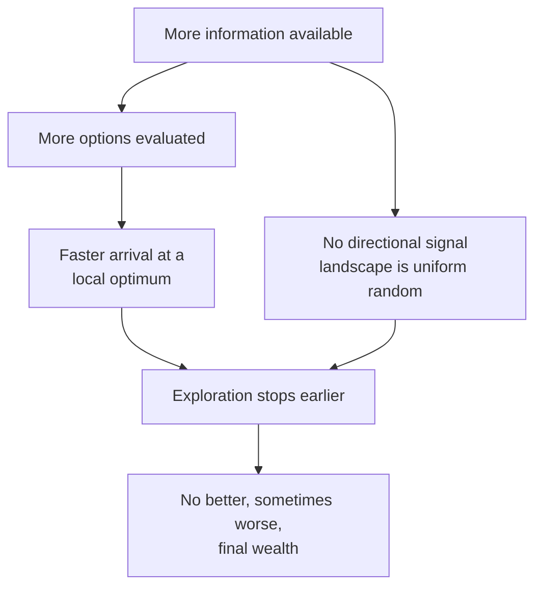

# Week 5b — Modelling Agent Behaviour: Adaptation & Objectives

> [!abstract] Orientation — read this first (~1 min)
> **The problem this lecture solves.** Week 5a specified what gets *into* an agent. This
> one specifies what the agent does with it, and then tests the obvious assumption — that
> more information produces better decisions — by running the experiment. The assumption
> fails, and why it fails is the lecture.
>
> **Core claims**
> 1. Adaptive behaviour is a decision made in response to sensed information, to improve
>    the agent's state with respect to an objective. The objective is called *fitness* in
>    ecological models, *utility* in economic ones, *cost* when minimised.
> 2. Widening the sensing radius improved mean investor wealth from radius 1 through 5,
>    then made it worse at radius 8. The optimum sat "around 5". More information is not
>    automatically better information.
> 3. A fully connected communication network also failed to beat the radius-1 baseline.
> 4. Both failures have the same structural cause: the investment landscape is uniformly
>    random with no correlation between adjacent patches, so a wider view reveals more
>    options but no **gradient** to follow.
> 5. Mean profit rises steeply on the first tick and then flattens — on a uniform random
>    landscape roughly half the neighbours beat your current patch, so the first move
>    almost always improves things and later moves have less headroom.
> 6. Mean risk falls and then plateaus, because $(1-F)^T$ weights survival more heavily as
>    the horizon shortens. Agents become risk-averse, find a local optimum, and stop.
> 7. Real agents cannot optimise — information is unavailable or too costly — so they
>    satisfice against an aspiration threshold. Greedy strategies tend to be suboptimal,
>    and satisficing agents often end up closer to the optimum.
> 8. Changing the objective function changes the model. Different subsets of agents can
>    carry different objectives, which is how heterogeneous risk appetite enters an ABM.
>
> **Prerequisites.** [[w05a-sensing]] — the model's ODD and the sensing taxonomy.
> [[optimisation]], [[satisficing]], [[objective-function]].
> **Where it sits.** Closes Week 5. The proposed satisficing rewrite of the model and the
> alternative objective functions are both deferred to Week 6.
> **Sources.** Deck (15 slides) + recording (~50 min, roughly half of it live NetLogo) ·
> **digest read time ~10 min**

---

## The Spine

### Academic integrity and the AI policy
`no slides` · `00:42–05:10`

Assessed work must be your own. Contract cheating is major academic misconduct, and Muñoz
noted that students who outsource assessments have subsequently been blackmailed over it;
serious findings can cost a degree or an accreditation.

The generative-AI policy permits use with disclosure. The two failure modes he named are
worth taking literally because they are what gets caught:

- **Fabricated citations.** Students have cited work that does not exist, and work cited
  *by* other papers that turned out to be hallucinated in turn. This is why every citation
  needs a **DOI** — marks are deducted for presentation without them, because the DOI is
  what makes checking cheap.
- **Recognisable prose.** "It has a way of writing that is overly optimistic, full of
  things like *I'm being honest with this*, or *you should be aware of that*, or *the real
  reason is* — these kinds of phrases that are sort of packaged and very easy to identify,
  and they don't do nothing but fluff her."

You remain responsible for errors, and may be asked where information came from — which
is a question, not an accusation.

### The model, second pass
`slides 2–7` · `05:15–15:45`

A more careful walk through the same ODD as [[w05a-sensing]] — see the full reproduction
in that digest, and [[business-investment-model]]. What the second pass adds is the
argument about the *assumptions*, which is the part that transfers.

**Failure is catastrophic.** All money in, and if the business fails you lose all of it.
Not a drawdown — a reset to zero.

**One agent per opportunity.** Opportunities are fixed and exclusive, which is what
manufactures competition between agents who never communicate.

**One decision per year, no do-overs.** Each tick is a year; you commit and are stuck for
that period. And there is **no learning** — nothing accumulated in one simulation carries
to the next. Muñoz defended this as a reasonable assumption for the scenario: it is a
retirement decision, and at sixty you do not get another run.

**Prediction is exact, and that is the big one.** $P$ and $F$ are static, so the
projection is arithmetic rather than forecasting.

> [!mic] Not on the slides — `09:00`
> "In financial markets, nobody can tell you for certain what is going to be the
> opportunity of a particular investment. That's the reason they put you this disclaimer
> that says returns is no indication of future returns."
>
> Real profit and failure risk move. NVIDIA was a niche supplier of gaming hardware not
> long ago. Modelling prediction as perfect converts an economics problem into an
> arithmetic one — see [[agent-prediction]].

**Profit and risk are uncorrelated**, drawn as independent uniforms. Muñoz flagged this as
contradicting the standard intuition that the most profitable opportunities are also the
riskiest — the intuition that motivates portfolio construction in the first place. Here
there is no such trade-off structure in the landscape, only in the utility function.

#### Reading the utility function
`slide 5` · `10:59`

$$U = (W + TP)(1 - F)^{T}$$

Two parts, and they are deliberately not separable:

- $(W + TP)$ — projected wealth. Current wealth plus horizon $T$ times annual profit $P$.
  For a 25-year horizon, $T = 25$.
- $(1-F)^T$ — probability of surviving $T$ years at annual failure probability $F$.

Multiplied rather than optimised separately: an opportunity is worth what it pays *times*
the chance it survives to pay it. If you wanted the two objectives handled independently
you would need two equations; here they are conflated on purpose, and the conflation is
what produces the model's most interesting behaviour.

> [!mic] Not on the slides — `09:35`
> The objective function is also called the **fitness function** or the **cost function**,
> depending on what is being improved. Same object, three vocabularies.

### The interface
`slide 7` · `15:48–17:00`

Two controls:

- **use-links** — whether agents sit on a communication network.
- **sensing radius** — how many cells out the agent can see. Radius 1 is the immediate
  eight; radius 2 adds the next ring; and so on. The count of visible cells at radius $r$
  on a square grid is $(2r+1)^2 - 1$.

Outputs plotted: mean wealth, mean profit, mean risk.

---

### Experiment 1 — sensing radius 1
`slide 7` · `17:05–22:50`

Step the model one tick at a time and watch.

**Tick 1.** Barely any movement — one patch left, at most. But wealth is up and risk is
down. Why? The agent examines its immediate surroundings and takes the best of them. The
landscape is uniformly distributed, so there is roughly a 50/50 chance any given
neighbouring cell beats the current one. Across eight neighbours, the agent will almost
certainly find one that both decreases risk and increases profit. **The first step is
always an improvement.**

**Tick 2 onwards.** The gradient diminishes. The agent has explored a little more area and
made another choice, and the probability of improving in expected value is about the same
50/50 — but from a higher baseline, so the increments shrink. Profit goes up a little,
down a little, and flattens.

**Risk.** Keeps declining, then plateaus. Two mechanisms combine: agents that find no
better opportunity within radius 1 are stuck at a local optimum and stop moving, and the
$(1-F)^T$ term makes low-risk patches progressively more attractive as $T$ runs down.

**Result.** Final mean wealth ≈ **140,000**, with a spread of roughly 70,000 across agents.
Starting wealth was zero and annual profits run 1,000–10,000, so ~140k over 25 years is a
plausible outcome rather than a windfall.

### Experiment 2 — radius 2, then 5
`slide 7` · `23:16–29:55`

Hypotheses from the room before the run: more choices, so lower-risk opportunities
available; profit probably up; the ability to jump over a local optimum; possibly a
narrower spread.

**Radius 2** — agents mostly move one step, some jump two. Profit up slightly, risk down.
Final mean wealth ≈ **150,000**, about 10,000 better. "Generally better."

**Radius 5** — the first step now does most of the work; the profit and risk curves are
front-loaded and then flat. Agents reach a local optimum quicker and then stop. Final mean
wealth ≈ **160–165,000**, about 20,000 above the radius-1 baseline.

> [!mic] Not on the slides — `28:50` — the learning-rate analogy
> "You can relate this if you have seen machine learning — you have these learning rates.
> When you increase the learning rate you might be able to advance quicker, but then if you
> reach a local optimum, you might get stuck in there."
>
> A larger sensing radius is a larger step size. It buys faster convergence and pays for it
> in exploration.

### Experiment 3 — radius 8, and the paradox of choice
`slide 7` · `29:59–33:00`

The room's extrapolation: more information has helped twice, so radius 8 should be better
again.

It is not. Mean wealth falls below the radius-5 figure of ~165,000.

Muñoz's structural explanation, and his honest caveat, are worth separating.

The **structural reason**, which he committed to: the landscape is uniform random with no
correlation between adjacent patches. There is no pattern, nothing that guides you toward
a better region. A wider view therefore shows you more options but no *direction*. Combined
with faster convergence to a local optimum, more sensing buys less.

The **label**, which he offered as a hypothesis: the **paradox of choice**.

> [!mic] Not on the slides — `36:35` — asked to define the paradox of choice
> "When you have more information or more choices available, there is more opportunity for
> regret. When you go to a restaurant and you have a massive menu, there is more
> opportunity for you to suffer decision paralysis. And then you're always going to feel
> regret if what you ordered wasn't as good as what you had."
>
> Pressed on how that plays out mechanically at a larger radius: *"this is my hypothesis
> because this is not tested... that doesn't sound very clear, I have to think about it a
> little bit more."* Take the empirical result as the finding and the paradox-of-choice
> framing as a label awaiting a mechanism.

Two clarifications from the room. Every choice is evaluated **deterministically**; the only
stochastic elements are the initial landscape, the update order, and whether a business
fails on a given tick. And the landscape is re-drawn between runs, which does shift results
— but from the same distribution, so it changes the spread of end results rather than the
pattern, and would converge over repeated runs. (Properly: this is what a BehaviorSpace
sweep with replicates is for. See [[model-analysis]].)

### Experiment 4 — the communication network
`slide 7` · `33:05–36:25`

Reset the radius to 1 and switch on **use-links**, creating a dense network in which every
agent can see what every other agent is doing. The room's hypothesis: this should behave
like a massive sensing radius.

Result: **not as good** as the radius-1 baseline of ~140,000, despite strictly more
information.

The explanation is the same one as before, and this is where it becomes convincing rather
than ad hoc. Knowing that a distant agent is doing well tells you *how well others are
doing* — useful for comparing your own opportunity against the average — but says nothing
about **which direction to move**, because the landscape has no gradient to point along.
And agents still move only one cell per tick.

---

### Adaptation and objectives
`slides 8–9` · `39:13–43:20`

> [!quote] Slide 9, reproduced
> An interest in how individuals make decisions, and how these decisions collectively
> shape the behaviour of a whole system, is one of the primary reasons for using
> agent-based models.
>
> An agent's behaviour is something that it does during a simulation. **Adaptive
> behaviour** is a decision made in response to information acquired (i.e., sensed) about
> its current state and that of its environment to improve its state with respect to some
> objective.
>
> Objectives will differ depending on the model context and are sometimes referred to as
> **fitness** in the context of ecological systems, or **utility** in the context of
> economic systems.

The observed behaviour makes the definition concrete: an agent that has found a good
opportunity becomes risk-averse, is unwilling to explore, and gets stuck. That is adaptive
behaviour doing exactly what it was specified to do.

Fitness in an ecological model is the predator-prey case from Week 4 — an agent with
enough energy to reproduce is fitter than one without, so "accumulate enough energy" is
the objective. See [[adaptive-behaviour]] and [[objective-function]].

### Satisficing
`slides 10–13` · `43:27–48:15`

The model's agents treat the decision as an **optimisation problem**: consider the full set
of alternatives open to them, evaluate the utility of each, select the best.

> [!quote] Slide 10, reproduced
> In the real world, we are typically unable to optimise because:
> - all the information required may not be available to us; or
> - it might be too time-consuming or costly to obtain.
>
> Instead, we often **satisfice**, i.e., choose an alternative that is "good enough" even
> though it may not be the absolute best choice available.

**Satisfice** = satisfy + suffice, coined by [[herbert-simon|Herbert Simon]] — economist,
political scientist and cognitive scientist — in the 1950s. The slide poses the rhetorical
question directly: how realistic is it that an investor can accurately assess a
prospective opportunity's profits and risks, particularly projected forward over multiple
years?

> [!mic] Not on the slides — `42:20` — what information actually costs
> "One of the most important things if you are working in an investment firm is to have
> access to Bloomberg terminals, and I think having one of them is like 30,000 per year."
> For a firm with several analysts that is a serious capital commitment, and as an
> individual you have no access to it at all. Information is not a free good — which is
> half of why optimisation is unavailable. See [[bounded-rationality]].

Slide 12 names the asymmetry underneath: **we know more about our current situation than
about the alternatives.** We often have to choose to switch without being able to predict
the consequences. So when do we switch? The standard assumption: an agent makes no change
while it is doing well, and changes when it is doing less well — defined against a
**satisficing threshold**.

> [!example] The proposed rewrite of the model
> Define a satisficing threshold as a **minimum rate of return — say 5%**.
>
> If an agent's current investment is not increasing its wealth by 5% each year over the
> time horizon it is considering, it moves. Critically, the agent now has **no ability to
> obtain information about other opportunities**, so it chooses a new available patch
> **at random**.
>
> The slide's two questions: How does the satisficing threshold affect an agent's
> performance? How close to optimal can satisficing get?

The 5% figure is not arbitrary. Investment products are commonly pitched as returning
4–5% *over inflation*, because inflation erodes the value of money and clearing it by a
margin is what makes the product worth buying.

Muñoz's prediction, to be tested in Week 6: performance improves. Satisficing agents keep
exploring, are willing to take a short-term decrease, and that can pay off over the longer
horizon — with no guarantee, because the failure probability is still there. His summary:
**greedy strategies tend to be suboptimal in most cases.**

### Choosing the objective function
`slide 14` · `48:18–49:20`

> [!quote] Slide 14, reproduced
> The objective function is the criterion that agents will use to decide. Clearly,
> choosing an appropriate objective function is therefore important. Different objective
> functions will lead to different agent decisions and different model behaviours.
>
> Assume, in the Business Investor model, that it was also possible for companies to make
> a loss, i.e. have a negative profit value. This opens scope for alternative objective
> functions as agents seek not only to avoid failure but also to avoid going broke.
>
> For example:
> - Agents may ignore risk and seek only to maximise profit.
> - Agents may ignore wealth and profit and seek only to avoid failure from either random
>   risk or negative profit.
>
> A further possibility is that subsets of agents could each be using a different
> objective function.

The last line is the one with reach. Heterogeneous objectives are how you put risk-takers
and risk-avoiders in the same run — Muñoz's examples were option traders running high
leverage against conservative investors, possibly differing in wealth too, possibly
differing in whether they share information. Heterogeneity of *objective*, not just of
parameter, changes how the whole system behaves.

### Summary
`slide 15` · `49:30`

> [!quote] Slide 15, reproduced
> Sensing is how agents obtain information about themselves, other agents and the
> environment. Adaptation is how agents make decisions to improve their state. Objectives
> are the criteria used by agents to decide.
>
> **Remember, the goal in agent-based modelling is not to optimise the performance of a
> system.**
>
> Real-world systems frequently involve individuals making decisions under uncertainty,
> with limited and/or imperfect information. Agent-based models provide us with a framework
> to evaluate the implications of this imperfect decision-making on the behaviour of
> systems.

The bolded sentence is the one to hold. The objective function belongs to the *agents*.
The modeller's interest is in what their pursuit of it produces collectively — which is a
different question, and often has an uncomfortable answer.

---

## Recall Layer

> [!question]- Define adaptive behaviour precisely, as the slide states it.
> A decision made in response to information acquired (sensed) about the agent's current
> state and that of its environment, in order to improve its state with respect to some
> objective. Note the three required pieces: sensed information, an objective, and an
> action. `39:13`

> [!question]- What are the three names for an objective function, and where does each come from?
> **Fitness** in ecological systems, **utility** in economic systems, **cost** (or loss)
> when the quantity is minimised. Same object, different vocabularies. `09:35`, `40:29`

> [!question]- Why does mean profit rise steeply on the first tick and then flatten?
> The landscape is uniformly distributed, so roughly half of any agent's neighbours beat
> its current patch. Across eight neighbours the first move is almost certain to improve
> both profit and risk. Subsequent moves face the same ~50/50 odds but from a progressively
> higher baseline, so the increments shrink. `18:29`

> [!question]- Why does mean risk fall and then plateau?
> Two mechanisms. Agents that see no better opportunity within their radius are at a local
> optimum and stop moving. And the $(1-F)^T$ factor weights survival more heavily as the
> remaining horizon shortens, so low-risk patches become progressively more attractive and
> agents will not trade safety back for profit. `21:53`

> [!question]- What happened to final mean wealth as the sensing radius went 1 → 2 → 5 → 8?
> Roughly 140k → 150k → 160–165k → *down*. The optimum sat "around 5". More information
> helped up to a point and then hurt. `17:05`–`31:05`

> [!question]- Give the structural reason widening the sensing radius eventually hurts.
> The investment landscape is uniformly random with no correlation between adjacent
> patches. A wider view reveals more options but no **gradient** — nothing indicating which
> direction is better. Meanwhile the bigger effective step size gets the agent to a local
> optimum faster, after which it stops exploring. `32:06`

> [!question]- Why did a fully connected communication network fail to beat the radius-1 baseline?
> Same reason. Knowing how well distant agents are doing lets an agent compare itself
> against the average, but conveys no directional information on an unstructured landscape.
> Agents also still move only one cell per tick. `33:05`

> [!question]- What is the paradox of choice as Muñoz stated it, and how confident should you be in it here?
> More available choices means more opportunity for regret, and decision paralysis — the
> large restaurant menu. As an explanation of the radius-8 result he explicitly marked it
> as an untested hypothesis he had not fully worked out. The *result* is solid; the *label*
> is provisional. `36:35`

> [!question]- Why can real decision-makers usually not optimise?
> Either the required information is not available, or obtaining it is too time-consuming
> or costly. Muñoz's concrete example: a Bloomberg terminal seat at roughly $30{,}000$ per
> year — professional-grade information is a capital expense. `43:27`

> [!question]- What is a satisficing threshold, and how would you implement one in this model?
> An aspiration level: keep doing what you are doing while performance clears it, switch
> when it does not. In the business investment model, a minimum rate of return of 5% a
> year over the horizon. An agent below threshold moves — and, in the proposed version,
> moves to a **randomly chosen** available patch, because it can no longer evaluate
> alternatives. `47:42`

> [!question]- Why might satisficing agents outperform optimising ones here?
> The optimisers settle on the best patch they can see, become risk-averse as the horizon
> shortens, and stagnate at a local optimum. Satisficers keep moving while below
> aspiration, accept short-term decreases, and explore more of the landscape. Greedy
> strategies tend to be suboptimal. No guarantee attached — more movement also means more
> exposure to the failure probability. `48:00`

> [!question]- Name two alternative objective functions for this model if businesses could post negative profits.
> Ignore risk and maximise profit only; or ignore wealth and profit entirely and seek only
> to avoid failure, whether from random risk or from negative profit. A third possibility:
> different subsets of agents using different objective functions in the same run. `48:18`

> [!question]- What is the only stochastic content of the model, given that agents choose deterministically?
> The initial landscape (profit and risk drawn at random), the update order, and whether a
> business fails on a given tick. Every utility evaluation and choice is deterministic.
> `31:31`

> [!question]- Why does the subject require a DOI on every citation?
> Because fabricated references are the characteristic AI failure — students have cited
> non-existent work, and work cited by other papers that was itself hallucinated. A DOI
> makes verification cheap. Missing DOIs cost presentation marks. `03:44`

> [!failure] Common failure modes
> - **Assuming more information monotonically improves outcomes.** This lecture exists to
>   break that assumption. Ask what *structure* the extra information has.
> - **Reading the paradox of choice as an established mechanism.** It is the lecturer's
>   provisional label for an empirical result.
> - **Separating the two terms of $U$.** $(W+TP)$ and $(1-F)^T$ are multiplied on purpose;
>   optimising them independently is a different model requiring two equations.
> - **Saying agents become *less* risk-averse over time.** The recording contains one
>   phrasing in that direction, but every mechanism and every plot points the other way —
>   see the open threads.
> - **Confusing the objective's owner.** The objective function belongs to the agents; the
>   modeller is not optimising the system.
> - **Treating "no correlation between profit and risk" as realistic.** It is a deliberate
>   simplification that removes the trade-off structure real portfolio construction exists
>   to handle.
> - **Reading the live-demo numbers as measurements.** They are single runs read off a plot
>   with a re-drawn landscape each time; a real claim needs a parameter sweep with
>   replicates.

> [!exam] Exam surface
> - **Explain a non-monotonic parameter result** — why more sensing helps then hurts. The
>   gradient/local-optimum argument is the expected answer.
> - **Optimising vs satisficing**: define both, state when each is appropriate, and give a
>   satisficing threshold for a described model.
> - **Interpret the utility function** — what each term does, and what the $(1-F)^T$ factor
>   implies about behaviour late in a run.
> - **Propose an alternative objective function** for a described scenario and predict how
>   model behaviour changes.
> - **Identify which model assumptions are strong** and say what relaxing each would cost.
> - Adaptation vs learning again — carried over from [[w05a-sensing]] and explicitly
>   examinable.

> [!todo] Open threads
> - **A stated contradiction.** At `22:08` the recording says agents "become a little bit
>   less risk averse" late in the run. Everything else points the other way: the plotted
>   risk declines and plateaus, agents stagnate on low-risk patches, and Week 5a states
>   plainly that agents "become more risk averse because of this all-or-nothing situation".
>   Read it as a slip or a transcription error; the mechanism ($(1-F)^T$ dominating as $T$
>   shrinks) gives *more* risk aversion. Muñoz deferred the full treatment to the following
>   week.
> - **The satisficing variant was never run.** Its predicted result — closer to optimal
>   than greedy — is a hypothesis stated at the end of the lecture, deferred to Week 6.
> - **The paradox-of-choice mechanism is unresolved**, by the lecturer's own admission.
> - **No replicates.** Every reported number is one run on a freshly drawn landscape. The
>   pattern was described as stable across repeats but no distribution was shown.

---

## Topics covered

- [x] `no slides` — academic integrity, contract cheating, generative-AI policy, DOIs → [[#Academic integrity and the AI policy]]
- [x] `slide 1` — title
- [x] `slides 2–6` — business investment model ODD, second pass → [[#The model, second pass]]
- [x] `slide 5` — the utility function in detail → [[#Reading the utility function]]
- [x] `slide 7` — submodels, initialisation, and the NetLogo interface → [[#The interface]]
- [x] `slide 7` — sensing radius 1 → [[#Experiment 1 — sensing radius 1]]
- [x] `slide 7` — radius 2 and 5 → [[#Experiment 2 — radius 2, then 5]]
- [x] `slide 7` — radius 8, paradox of choice → [[#Experiment 3 — radius 8, and the paradox of choice]]
- [x] `slide 7` — communication network → [[#Experiment 4 — the communication network]]
- [x] `slides 8–9` — adaptation and objectives defined → [[#Adaptation and objectives]]
- [x] `slides 10–13` — satisficing, Simon, satisficing thresholds → [[#Satisficing]]
- [x] `slide 14` — choosing and varying the objective function → [[#Choosing the objective function]]
- [x] `slide 15` — summary → [[#Summary]]

## Connections

`See also:` [[adaptive-behaviour]], [[objective-function]], [[satisficing]],
[[optimisation]], [[bounded-rationality]], [[imperfect-information]],
[[agent-neighbourhood]], [[business-investment-model]], [[herbert-simon]],
[[w05a-sensing-digest]], [[kennedy-2012-modelling-human-behaviour-digest]]
